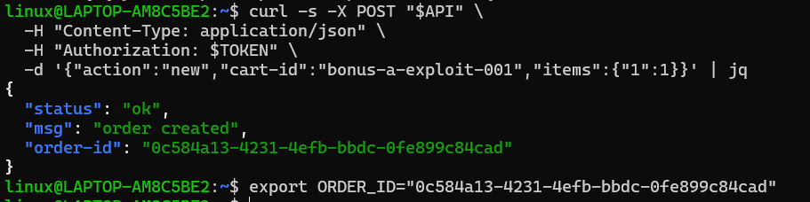
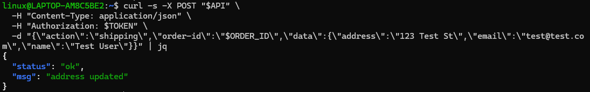
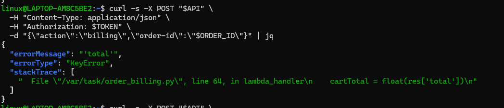
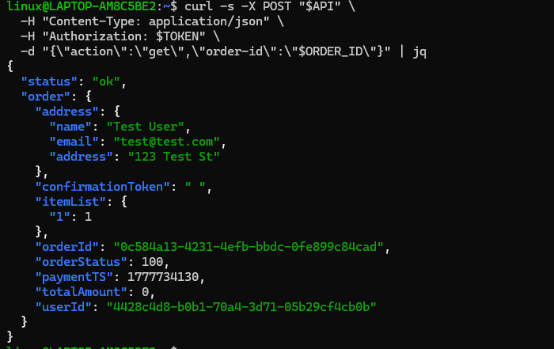
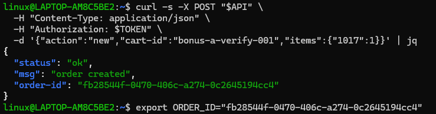
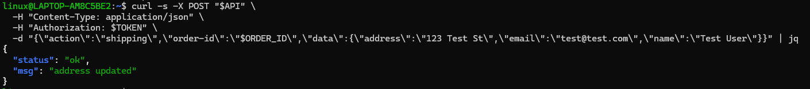
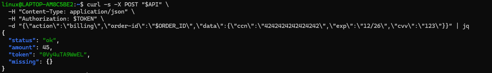
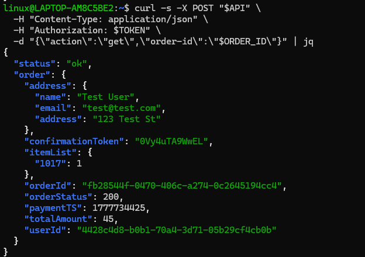

# Bonus Vulnerability A: Billing Response Parsing Error — Free Order (totalAmount: 0)

---

## Part 1) Goal and Vulnerability Summary

This is an undocumented bonus vulnerability discovered in the DVSA-ORDER-BILLING Lambda function. The billing function calls an internal cart total service to calculate the price of an order before charging the user. However, the billing Lambda incorrectly reads the response from the cart total service by accessing res['total'] directly, without first unwrapping the response body. The cart total service returns its result wrapped inside a body key, so res['total'] always fails with a KeyError. When this error occurs, the billing workflow crashes mid-execution, but the order status still gets partially updated in DynamoDB with totalAmount: 0. This means a user can place an order and complete the billing flow while paying absolutely nothing, resulting in a complete price integrity failure.

---

## Part 2) Why This Works / Root Cause

The DVSA-GET-CART-TOTAL Lambda returns its response in this format:

```json
{"statusCode": 200, "body": "{\"status\": \"ok\", \"total\": 45.0}"}
```

But the billing Lambda reads it as:

```python
res = json.loads(req.data)
cartTotal = float(res['total'])
```

It tries to access total directly from the top-level response, but total is nested inside the body string. This causes a KeyError: 'total' every time. The order then gets saved with totalAmount: 0 because the correct total was never calculated. The root cause is a response parsing mismatch between two internal Lambda functions.

---

## Part 3) Environment and Setup

- **API Endpoint:** `https://[API-ID].execute-api.us-east-1.amazonaws.com/Stage/order`
- **Affected Lambda:** `DVSA-ORDER-BILLING`
- **Affected File:** `order_billing.py`
- **Secondary Function:** `DVSA-GET-CART-TOTAL`
- **AWS Region:** us-east-1
- **Tools:** curl, jq, Browser DevTools, AWS Lambda Console

---

## Part 4) Reproduction Steps

**Step 1 — Export API and TOKEN**
```bash
export API="https://[API-ID].execute-api.us-east-1.amazonaws.com/Stage/order"
export TOKEN="[REDACTED]"
```

**Step 2 — Create new order with item 1**
```bash
curl -s -X POST "$API" \
  -H "Content-Type: application/json" \
  -H "Authorization: $TOKEN" \
  -d '{"action":"new","cart-id":"bonus-a-exploit-001","items":{"1":1}}' | jq
```

**Step 3 — Export ORDER_ID and add shipping**
```bash
export ORDER_ID="[returned order-id]"

curl -s -X POST "$API" \
  -H "Content-Type: application/json" \
  -H "Authorization: $TOKEN" \
  -d "{\"action\":\"shipping\",\"order-id\":\"$ORDER_ID\",\"data\":{\"address\":\"123 Test St\",\"email\":\"test@test.com\",\"name\":\"Test User\"}}" | jq
```

**Step 4 — Run billing WITHOUT card details**
```bash
curl -s -X POST "$API" \
  -H "Content-Type: application/json" \
  -H "Authorization: $TOKEN" \
  -d "{\"action\":\"billing\",\"order-id\":\"$ORDER_ID\"}" | jq
```

**Step 5 — Check order state**
```bash
curl -s -X POST "$API" \
  -H "Content-Type: application/json" \
  -H "Authorization: $TOKEN" \
  -d "{\"action\":\"get\",\"order-id\":\"$ORDER_ID\"}" | jq
```

---

## Part 5) Evidence and Proof

**Screenshot 1 — Export API and TOKEN:**


**Screenshot 2 — Create order:**


**Screenshot 3 — Add shipping:**


**Screenshot 4 — Billing error KeyError: total:**


**Screenshot 5 — Order state showing totalAmount: 0:**


---

## Part 6) Fix Strategy / Probable Mitigation

The fix was applied inside the DVSA-ORDER-BILLING Lambda function in order_billing.py. The billing function must check whether the cart total response is wrapped inside a body key before trying to read the total. If the body key exists, the function must parse it as a second JSON decode step before accessing total. This directly addresses the root cause because it correctly handles the HTTP-style response format returned by the cart total service.

---

## Part 7) Code / Config Changes

**File:** `order_billing.py` → `DVSA-ORDER-BILLING`

See `fix/vulnerable-order-billing.py` for the before code.
See `fix/fixed-order-billing.py` for the after code.

**BEFORE (Vulnerable):**
```python
res = json.loads(req.data)
cartTotal = float(res['total'])
missings = res.get("missing", {})
```

**AFTER (Fixed):**
```python
res = json.loads(req.data)
if 'body' in res:
    res = json.loads(res['body'])
cartTotal = float(res.get('total', 0))
missings = res.get("missing", {})
```

---

## Part 8) Verification After Fix

**Screenshot 6 — New order created with item 1017:**


**Screenshot 7 — Add shipping:**


**Screenshot 8 — Billing returns correct amount: 45:**


**Screenshot 9 — Order state showing totalAmount: 45:**


Billing now returns the correct amount and totalAmount is correctly stored in DynamoDB. The KeyError no longer occurs.

---

## Part 9) Structured Operation and Security Analysis

### Table A

| Vulnerability | Intended Rule(s) | Artifacts Used | Normal Behavior Evidence | Exploit Behavior Evidence |
|---|---|---|---|---|
| Bonus A — Billing Response Parsing Error | The billing function must correctly calculate and store the total amount for every order. A user must never complete billing with totalAmount: 0. | curl API requests and responses, order state via get action, order_billing.py source code, DVSA-GET-CART-TOTAL response format, CloudWatch logs | A correctly billed order with item 1017 returns amount: 45 and stores totalAmount: 45 in DynamoDB | Billing with item 1 triggers KeyError: total, crashes mid-execution, and stores totalAmount: 0 in the order record |

### Table B

| Vulnerability | Why This Is a Deviation | Deviation Class | Fix Applied (Where) | Post-Fix Verification | Optional Latency |
|---|---|---|---|---|---|
| Bonus A — Billing Response Parsing Error | The billing function failed to unwrap the cart total response correctly, causing it to crash before calculating the price. The order was still partially saved with totalAmount: 0, allowing users to receive items without paying the correct amount. | Accidental misconfiguration | Added body unwrapping check in order_billing.py inside DVSA-ORDER-BILLING Lambda | Billing now returns correct amount: 45 and order state shows totalAmount: 45. KeyError no longer occurs. | Not measured |

---

## Part 10) Takeaway / Lessons Learned

This bonus vulnerability showed us that security issues don't always come from malicious design — sometimes a simple coding mistake between two internal services can have serious financial consequences. The billing function and the cart total function were written independently and made different assumptions about the response format. Nobody caught this mismatch, and the result was that every billing attempt silently failed and recorded a total of zero. In a real application this would mean customers could order products for free. The lesson here is that internal service contracts need to be clearly defined and tested end-to-end, not just individually, because a mismatch between two functions can be just as dangerous as an external attack.