# Bonus Vulnerability B: SQL Injection in DVSA-GET-CART-TOTAL

---

## Part 1) Goal and Vulnerability Summary

This is an undocumented bonus vulnerability discovered in the DVSA-GET-CART-TOTAL Lambda function. The function queries an SQLite inventory database to look up item prices during the billing workflow. However, the item ID taken from the user's order is concatenated directly into the SQL query string without any sanitization or parameterization. This allows an attacker to inject arbitrary SQL by crafting a malicious item ID when creating an order. The injected SQL executes when billing is triggered, allowing the attacker to extract database schema information such as table names, manipulate query results, and cause the total amount to return as 0. The affected component is the inventory lookup logic inside DVSA-GET-CART-TOTAL, and the security impact includes database reconnaissance and potential price manipulation.

---

## Part 2) Why This Works / Root Cause

The vulnerable code builds the SQL query by string concatenation:

The item_id value comes directly from the order's item list, which the attacker controls when creating the order. Since no parameterized query or input validation is used, the attacker can close the intended query and append their own SQL. For example, injecting 1 UNION SELECT 1, GROUP_CONCAT(name), 0 FROM sqlite_master WHERE type='table' causes the query to return database table names in the price column instead of the actual price. The root cause is therefore the use of string concatenation to build SQL queries with user-controlled input.

---

## Part 3) Environment and Setup

- **API Endpoint:** https://[API-ID].execute-api.us-east-1.amazonaws.com/Stage/order
- **Affected Lambda:** DVSA-GET-CART-TOTAL
- **Affected File:** get_cart_total.py
- **AWS Region:** us-east-1
- **Tools:** curl, jq, Browser DevTools, AWS Lambda Console, CloudWatch Logs

---

## Part 4) Reproduction Steps

**Step 1 — Export API and TOKEN**

export API="https://[API-ID].execute-api.us-east-1.amazonaws.com/Stage/order"
export TOKEN="[REDACTED]"

**Step 2 — Confirm normal behavior with item 1017**

curl -s -X POST "$API" \
  -H "Content-Type: application/json" \
  -H "Authorization: $TOKEN" \
  -d '{"action":"new","cart-id":"sqli-normal-001","items":{"1017":1}}' | jq

Add shipping and run billing with card details — confirm amount: 45

**Step 3 — Create order with SQL injection payload**

curl -s -X POST "$API" \
  -H "Content-Type: application/json" \
  -H "Authorization: $TOKEN" \
  -d '{"action":"new","cart-id":"sqli-exploit-001","items":{"1 UNION SELECT 1, GROUP_CONCAT(name), 0 FROM sqlite_master WHERE type='\''table'\''":1}}' | jq

**Step 4 — Export ORDER_ID and add shipping**

export ORDER_ID="[returned order-id]"

curl -s -X POST "$API" \
  -H "Content-Type: application/json" \
  -H "Authorization: $TOKEN" \
  -d "{\"action\":\"shipping\",\"order-id\":\"$ORDER_ID\",\"data\":{\"address\":\"123 Test St\",\"email\":\"test@test.com\",\"name\":\"Test User\"}}" | jq

**Step 5 — Trigger billing to execute injected SQL**

curl -s -X POST "$API" \
  -H "Content-Type: application/json" \
  -H "Authorization: $TOKEN" \
  -d "{\"action\":\"billing\",\"order-id\":\"$ORDER_ID\",\"data\":{\"ccn\":\"4242424242424242\",\"exp\":\"12/26\",\"cvv\":\"123\"}}" | jq

**Step 6 — Check CloudWatch for injection evidence**

Go to CloudWatch → Log Management → /aws/lambda/DVSA-GET-CART-TOTAL
Look for: Found item: 1. Price: inventory, Quantity: 0.

---

## Part 5) Evidence and Proof

**Screenshot 1 — Export API and TOKEN:**
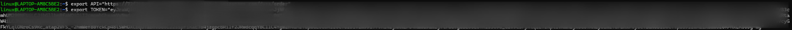

**Screenshot 2 — Normal order created with item 1017:**
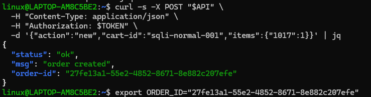

**Screenshot 3 — Normal shipping added:**
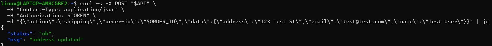

**Screenshot 4 — Normal billing showing amount: 45:**
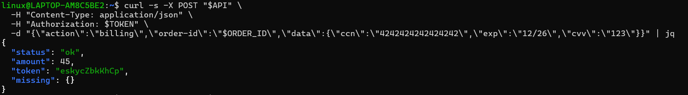

**Screenshot 5 — SQL injection order created:**
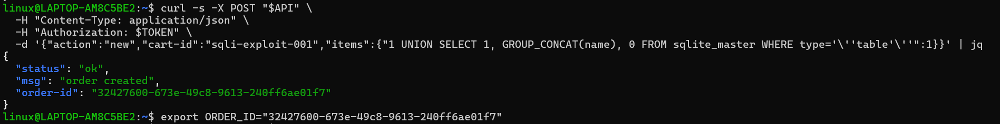

**Screenshot 6 — Billing triggered showing amount: 0:**
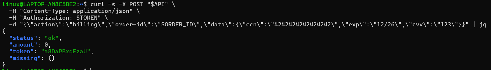

**Screenshot 7 — CloudWatch showing Found item: 1. Price: inventory:**
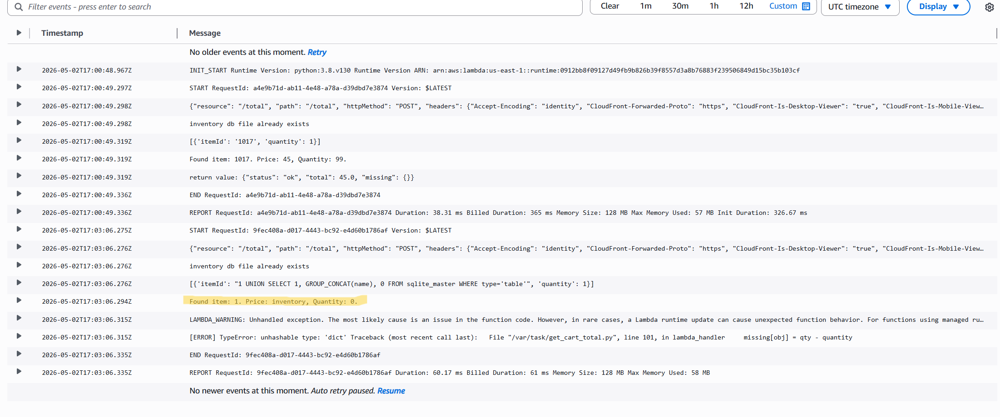

**Screenshot 8 — Vulnerable code in Lambda editor:**
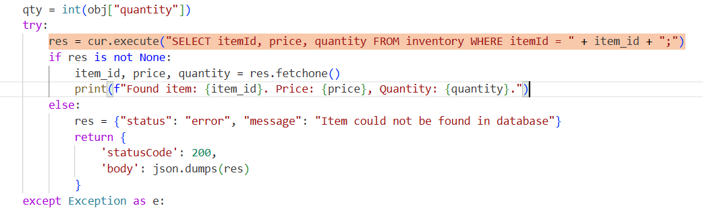

---

## Part 6) Fix Strategy / Probable Mitigation

The fix was applied inside the DVSA-GET-CART-TOTAL Lambda function in get_cart_total.py. The vulnerable string concatenation query was replaced with a parameterized query using SQLite's ? placeholder. With parameterized queries, the database driver treats the item ID as pure data and never as executable SQL, regardless of what the attacker puts in the item ID field. This directly addresses the root cause because it removes the possibility of SQL injection entirely by separating the query structure from the user-supplied data.

---

## Part 7) Code / Config Changes

**File:** get_cart_total.py in DVSA-GET-CART-TOTAL Lambda

See fix/vulnerable-get-cart-total.py for the before code.
See fix/fixed-get-cart-total.py for the after code.

BEFORE (Vulnerable):
res = cur.execute("SELECT itemId, price, quantity FROM inventory WHERE itemId = " + item_id + ";")

AFTER (Fixed):
res = cur.execute("SELECT itemId, price, quantity FROM inventory WHERE itemId = ?", (item_id,))

**Screenshot 9 — Fixed code in Lambda editor:**
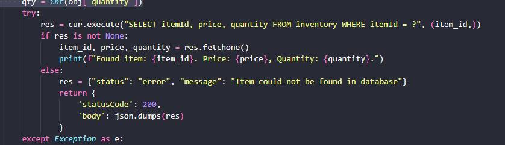

---

## Part 8) Verification After Fix

After deploying the fix, the same SQL injection payload was sent again. CloudWatch logs now show:
cannot unpack non-iterable NoneType object

The injected SQL string was treated as a literal item ID that does not exist in the inventory. The injection is fully blocked. Normal billing with item 1017 still returns amount: 45 correctly.

**Screenshot 10 — Verify fix new order created:**
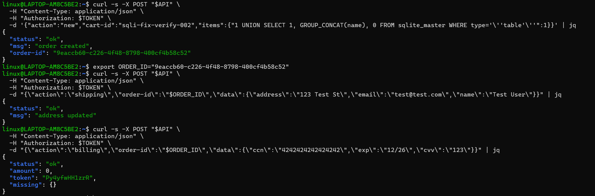

**Screenshot 11 — Normal behavior confirmed after fix:**
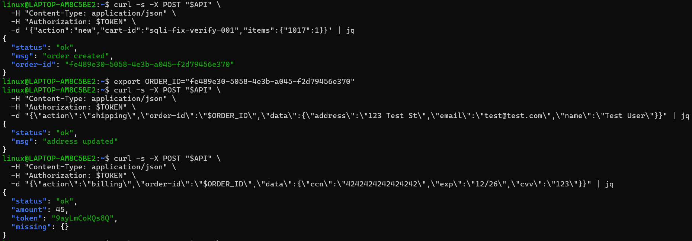

**Screenshot 12 — CloudWatch after fix showing injection blocked:**
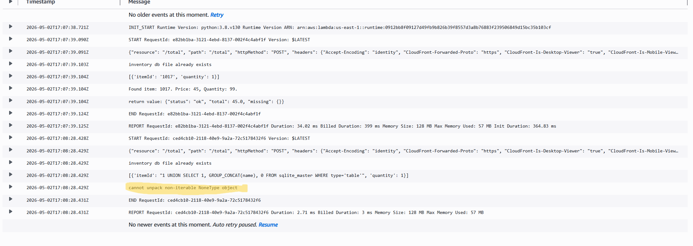

---

## Part 9) Structured Operation and Security Analysis

### Table A

| Vulnerability | Intended Rule(s) | Artifacts Used | Normal Behavior Evidence | Exploit Behavior Evidence |
|---|---|---|---|---|
| Bonus B — SQL Injection | Item IDs must be treated as data only and must never be executable as SQL. The inventory query must only return price data for the requested item. | curl API requests, order creation with malicious item ID, billing trigger, CloudWatch logs, get_cart_total.py source code | Normal order with item 1017 returns amount: 45. CloudWatch shows Found item: 1017. Price: 45, Quantity: 99 | SQL injection payload returns amount: 0. CloudWatch shows Found item: 1. Price: inventory, Quantity: 0 proving database schema was leaked |

### Table B

| Vulnerability | Why This Is a Deviation | Deviation Class | Fix Applied (Where) | Post-Fix Verification | Optional Latency |
|---|---|---|---|---|---|
| Bonus B — SQL Injection | The backend executed attacker-controlled SQL by concatenating the item ID directly into the query string. This allowed the attacker to extract database schema information and manipulate query results, violating the rule that user input must never be treated as executable code. | Intentional misuse / security-relevant abuse | String concatenation replaced with parameterized query using ? placeholder in get_cart_total.py inside DVSA-GET-CART-TOTAL Lambda | SQL payload now returns NoneType error in CloudWatch. Injection is blocked. Normal billing with item 1017 still returns amount: 45. | Not measured |

---

## Part 10) Takeaway / Lessons Learned

This vulnerability reminded us of one of the most fundamental rules in secure development — never trust user input and never concatenate it directly into a database query. SQL injection has been a well-known vulnerability for decades, yet it still appears in modern serverless applications when developers focus on functionality without thinking about how their code handles malicious input. What made this case interesting is that the injection happened indirectly — the attacker planted the malicious item ID during order creation, and the SQL only executed later when billing triggered the inventory lookup. This is a second-order injection pattern, which is harder to spot because the input and the execution happen at different stages of the workflow. The fix was a single line change, but the lesson is much bigger — always use parameterized queries, no exceptions.