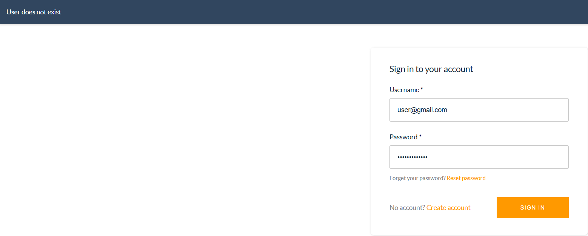
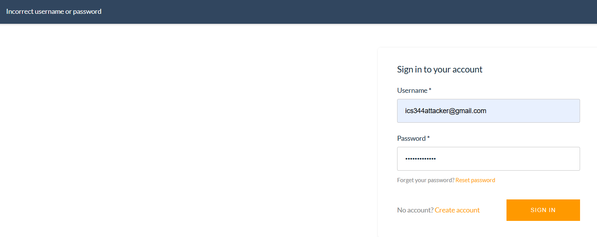
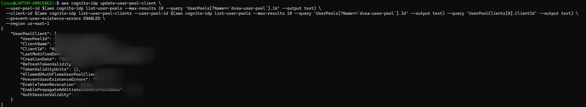
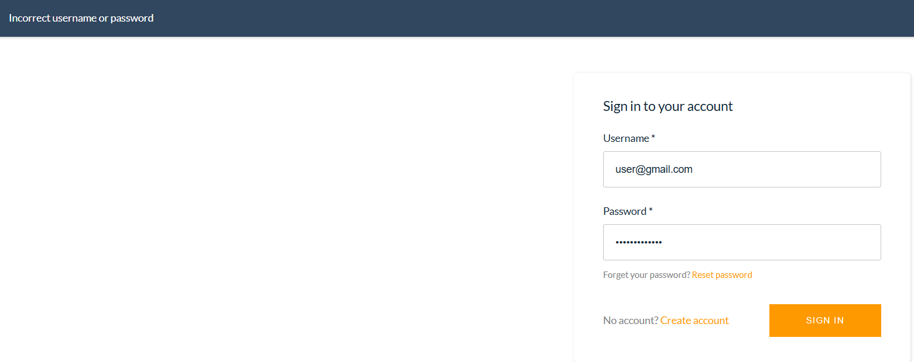
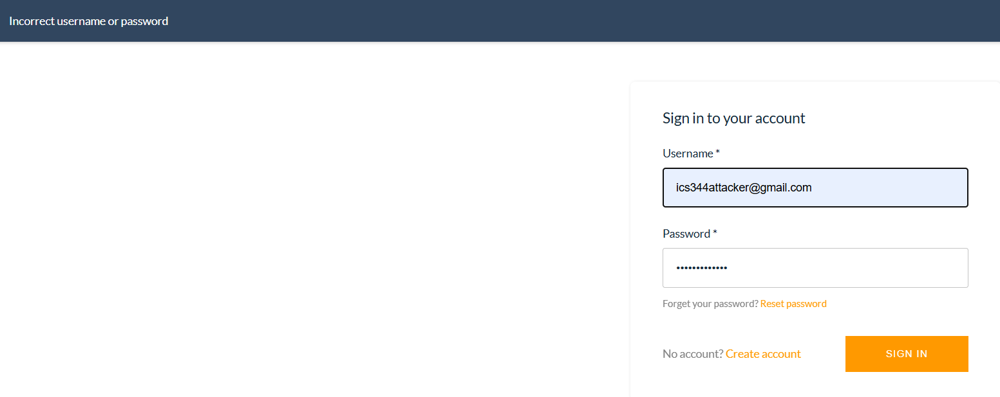

# Bonus Vulnerability 3: User Enumeration via Cognito Error Messages

---

## Part 1) Goal and Vulnerability Summary

This is an undocumented bonus vulnerability discovered in the DVSA authentication flow powered by Amazon Cognito. When a user attempts to log in, the application returns different error messages depending on whether the username exists in the system or not. A non-existent username returns "User does not exist" while a valid username with a wrong password returns "Incorrect username or password". This difference allows an attacker to enumerate valid usernames by simply attempting to log in and reading the error message. The affected component is the Amazon Cognito User Pool configuration, and the security impact includes account enumeration which can be used to build targeted lists of valid usernames for brute force or phishing attacks.

---

## Part 2) Why This Works / Root Cause

Amazon Cognito has a configuration setting called PreventUserExistenceErrors. When set to LEGACY, Cognito returns distinct error messages that reveal whether a username exists in the user pool. The root cause is therefore a missing security configuration in the Cognito App Client — the PreventUserExistenceErrors setting was never enabled, causing the authentication service to leak user existence information through its error responses.

---

## Part 3) Environment and Setup

- **DVSA Website:** https://YOUR-BUCKET.s3-website-us-east-1.amazonaws.com
- **Affected Service:** Amazon Cognito User Pool — dvsa-user-pool
- **Affected Setting:** PreventUserExistenceErrors on the Cognito App Client
- **AWS Region:** us-east-1
- **Tools:** Browser, AWS CLI
---

## Part 4) Reproduction Steps

**Step 1 — Attempt login with a non-existent username**

Go to the DVSA website login page and enter:
- Username: randomuser12345@test.com
- Password: Password123!

Observe the error message: "User does not exist"

**Step 2 — Attempt login with a valid username and wrong password**

Go to the DVSA website login page and enter:
- Username: [real registered account]
- Password: WrongPassword123!

Observe the error message: "Incorrect username or password"

The two different error messages confirm that an attacker can enumerate valid usernames.

---

## Part 5) Evidence and Proof

**Screenshot 1 — Non-existent user showing "User does not exist":**

**Screenshot 2 — Valid user wrong password showing "Incorrect username or password":**

---

## Part 6) Fix Strategy / Probable Mitigation

The fix was applied to the Amazon Cognito App Client configuration by enabling the PreventUserExistenceErrors setting. When set to ENABLED, Cognito returns the same generic error message regardless of whether the username exists or not, making it impossible for an attacker to distinguish between a non-existent user and a wrong password.

---

## Part 7) Code / Config Changes

**Service changed:** Amazon Cognito User Pool App Client

**Setting changed:** PreventUserExistenceErrors from LEGACY to ENABLED

See fix/vulnerable-config.md for the before configuration.
See fix/fixed-config.md for the after configuration.

**Fix command:**
aws cognito-idp update-user-pool-client \
  --user-pool-id us-east-1_XXXXXXXXX \
  --client-id [REDACTED] \
  --prevent-user-existence-errors ENABLED \
  --region us-east-1

**Screenshot 3 — AWS CLI fix command output:**

---

## Part 8) Verification After Fix

After applying the fix, both login attempts now return the same generic error message.

**Screenshot 4 — Non-existent user after fix:**

**Screenshot 5 — Valid user wrong password after fix:**

Both now show "Incorrect username or password" — enumeration is blocked.

---

## Part 9) Structured Operation and Security Analysis

### Table A

| Vulnerability | Intended Rule(s) | Artifacts Used | Normal Behavior Evidence | Exploit Behavior Evidence |
|---|---|---|---|---|
| Bonus 3 — User Enumeration | The authentication system must never reveal whether a username exists. All failed login attempts must return the same generic error message. | DVSA login page, browser error messages, AWS Cognito App Client configuration, AWS CLI output | A valid user with correct credentials logs in successfully | Non-existent user returns "User does not exist" while valid user with wrong password returns "Incorrect username or password" — two distinct messages confirm enumeration is possible |

### Table B

| Vulnerability | Why This Is a Deviation | Deviation Class | Fix Applied (Where) | Post-Fix Verification | Optional Latency |
|---|---|---|---|---|---|
| Bonus 3 — User Enumeration | The authentication service returned different error messages depending on whether the username existed, leaking user existence information to unauthenticated attackers. This violates the rule that all failed login attempts must produce identical responses. | Accidental misconfiguration | PreventUserExistenceErrors set to ENABLED on the Cognito App Client via AWS CLI | Both non-existent and valid usernames with wrong passwords now return "Incorrect username or password". Enumeration is no longer possible. | Not measured |

---

## Part 10) Takeaway / Lessons Learned

This vulnerability showed us that security misconfigurations are not always in the application code — sometimes they are in the cloud service settings that developers forget to configure properly. Amazon Cognito is a managed service that handles authentication, but it still requires careful configuration to be secure. The default LEGACY behavior that leaks user existence information has been a known issue for years, yet it still appears in many deployments because developers focus on getting authentication working rather than hardening it. The fix was a single CLI command, but the lesson is important — always review the security settings of every managed cloud service you use, not just your own code. A misconfigured managed service can be just as dangerous as vulnerable application code.