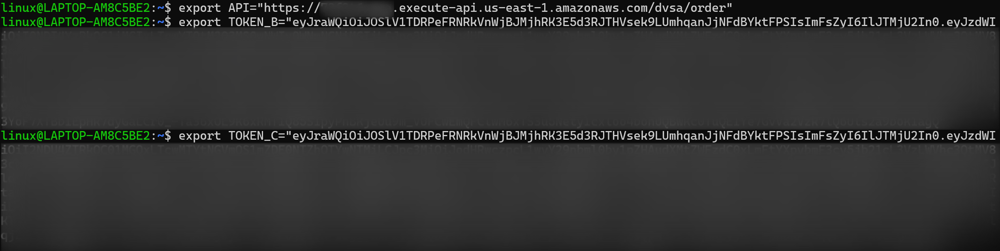
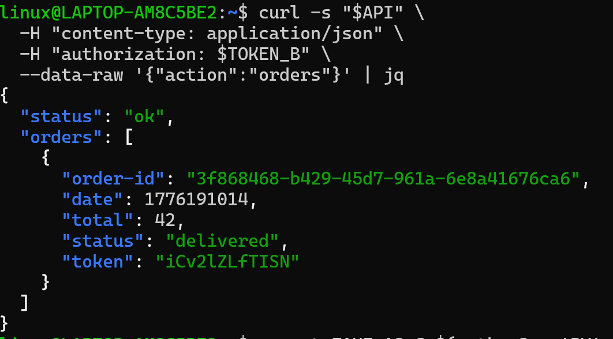
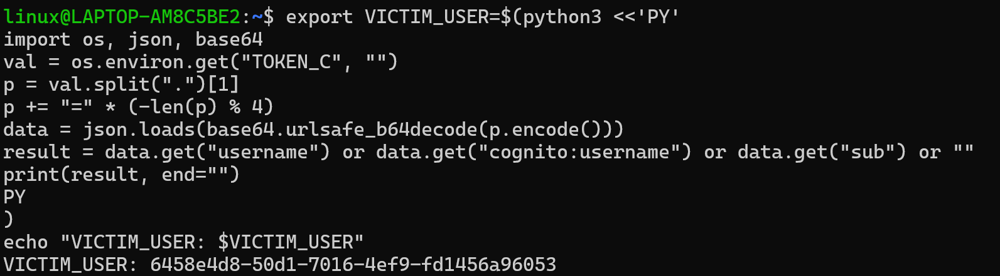
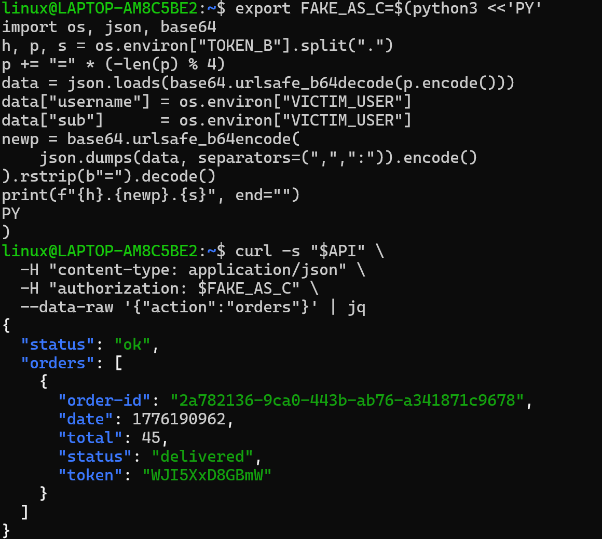
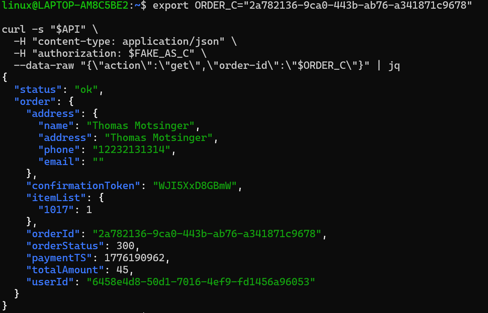
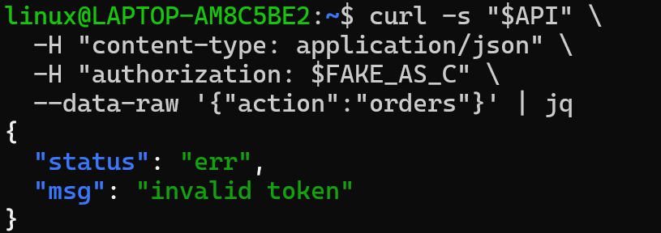
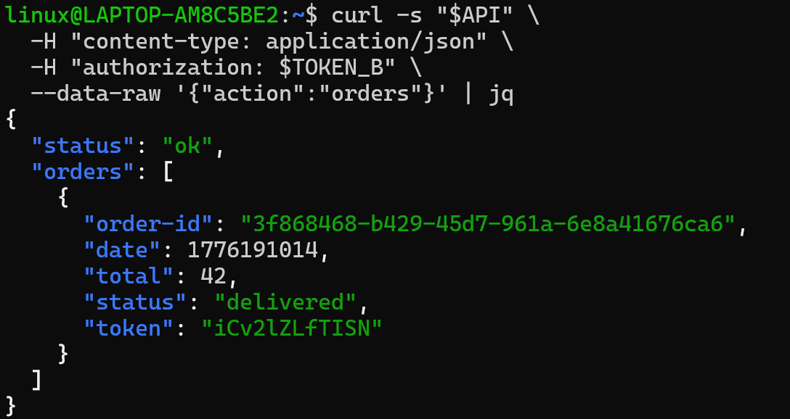

# Lesson #2: Broken Authentication

---

## Part 1) Goal and Vulnerability Summary

This lesson demonstrates a Broken Authentication vulnerability in the DVSA-ORDER-MANAGER AWS Lambda function. The application uses JSON Web Tokens (JWTs) issued by Amazon Cognito to identify users making requests. However, the backend Lambda function trusted identity claims from the JWT payload without verifying the token's cryptographic signature. This allowed an attacker to decode any valid JWT, replace the identity fields (username and sub) with another user's identity, re-encode the payload, and reuse the original signature. The backend accepted the forged token as valid and returned the victim's private order data, resulting in complete account impersonation and unauthorized access to other users' order information.

---

## Part 2) Why This Works / Root Cause

A JWT consists of three parts: header, payload, and signature. The signature exists to prove that the token was issued by a trusted identity provider and has not been modified. The vulnerable code in order-manager.js decoded the JWT payload using jose.util.base64url.decode() and directly used the username and sub fields for access control, without ever calling a signature verification function. Because the signature was never checked, an attacker could freely modify the payload claims and the backend would still accept the token. The root cause is therefore the absence of cryptographic JWT signature verification before trusting any identity field from the token.

---

## Part 3) Environment and Setup

- **API Endpoint:** `https://[API-ID].execute-api.us-east-1.amazonaws.com/Stage/order`
- **Affected Lambda:** `DVSA-ORDER-MANAGER`
- **Affected File:** `order-manager.js`
- **AWS Region:** us-east-1
- **Tools:** curl, python3, jq, Browser DevTools, VS Code

---

## Part 4) Reproduction Steps

**Step 1 — Create two accounts**
...

**Step 2 — Capture tokens**
```bash
export API="https://[API-ID].execute-api.us-east-1.amazonaws.com/Stage/order"
export TOKEN_B="[REDACTED]"
export TOKEN_C="[REDACTED]"
```

[continue all 7 steps]

---

## Part 5) Evidence and Proof

**Screenshot 1 — API and Tokens:**


**Screenshot 2 — Normal Behavior:**


**Screenshot 3 — Decode and Set Victim:**


**Screenshot 4 — Forge Token and Exploit:**


**Screenshot 5 — Steal Full Order Info:**


---

## Part 6) Fix Strategy / Probable Mitigation

The fix must be applied inside the DVSA-ORDER-MANAGER Lambda function, specifically in order-manager.js. The backend must fetch Cognito's public JWKS keys and use them to cryptographically verify the JWT signature before reading any identity claims. Additionally, basic claim validation must be enforced — including issuer (iss), expiration (exp), and token_use checks. This directly addresses the root cause because a forged token, even one with a modified payload, will fail signature verification since it was not signed by the legitimate Cognito identity provider. Any request with an invalid or tampered token must be rejected with a 401 Unauthorized response before the identity fields are ever used.
---

## Part 7) Code / Config Changes

**File:** `DVSA-ORDER-MANAGER/order-manager.js`

**BEFORE (Vulnerable):**
```javascript
var auth_header = headers.Authorization || headers.authorization;
var token_sections = auth_header.split('.');
var auth_data = jose.util.base64url.decode(token_sections[1]);
var token = JSON.parse(auth_data);
var user = token.username;
var isAdmin = false;
```

**AFTER (Fixed):**
```javascript
var auth_header = (headers.Authorization || headers.authorization || "");
var jwt = auth_header.replace(/^Bearer\s+/i, "").trim();
if (!jwt) {
    return callback(null, resp(401, { status: "err", msg: "missing authorization" }));
}
verifyCognitoJwt(jwt).then((claims) => {
    var user = claims.username || claims["cognito:username"] || claims.sub;
    if (!user) {
        return callback(null, resp(401, { status: "err", msg: "missing subject" }));
    }
    var isAdmin = false;
}).catch((e) => {
    console.log("JWT verify failed:", e);
    return callback(null, resp(401, { status: "err", msg: "invalid token" }));
});
```

---

## Part 8) Verification After Fix

**Screenshot 6 — Legitimate Access Still Works:**


**Screenshot 7 — Forged Token Rejected:**


The forged token now returns:
```json
{ "status": "err", "msg": "invalid token" }
```

---

## Part 9) Structured Operation and Security Analysis

### Table A

| Vulnerability | Intended Rule(s) | Artifacts Used | Normal Behavior Evidence | Exploit Behavior Evidence |
|---|---|---|---|---|
| Broken Authentication (Lesson #2) | Only a cryptographically verified JWT may determine user identity. User B must never access User C's orders. | Browser login flow, DevTools network capture, decoded JWT payload, curl terminal output, order-manager.js source code | TOKEN_B returns only User B's own orders (Screenshot 2) | Forged token returns User C's full order list and details (Screenshots 4 and 5) |

### Table B

| Vulnerability | Why This Is a Deviation | Deviation Class | Fix Applied (Where) | Post-Fix Verification | Optional Latency |
|---|---|---|---|---|---|
| Broken Authentication (Lesson #2) | Backend trusted unverified JWT payload claims for access control, allowing attacker-controlled identity fields to authorize access to another user's private data. | Intentional misuse / security-relevant abuse | JWT signature verification added to order-manager.js in DVSA-ORDER-MANAGER Lambda | Forged token now returns invalid token error. Legitimate token still works normally. (Screenshot 7) | Not measured |

---

## Part 10) Takeaway / Lessons Learned

This lesson demonstrates that decoding a JWT is not the same as verifying it. The security assumption that caused this vulnerability was treating the JWT payload as trustworthy simply because it could be decoded, without confirming that the cryptographic signature was valid and issued by the expected identity provider. In a serverless architecture, this flaw is especially dangerous because a single Lambda function handles all user requests — once the wrong identity is trusted, every downstream action is performed on behalf of the attacker. The secure design principle that prevents this class of vulnerability is to always verify before trusting