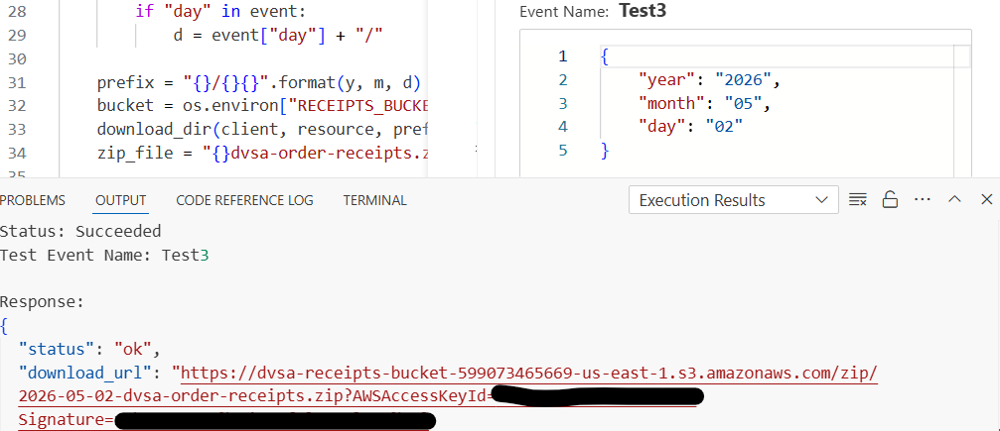
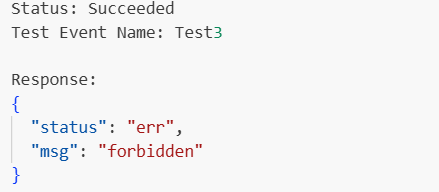

# Lesson #3: Sensitive Data Exposure

---

## Part 1) Goal and Vulnerability Summary

The DVSA-ADMIN-GET-RECEIPT Lambda is an admin-only bulk-receipt export function. The vulnerability is that it has no authorization check: it accepts a year, month, and day, downloads every customer receipt for that period from S3, and returns a preassigned download URL to whoever invokes it. Any user with Lambda Console access can trigger it and obtain a zip containing the full personally identifiable information of every customer who ordered on that date names, addresses, order items, and totals with no credentials required to open the download link.

---

## Part 2) Why This Works / Root Cause

The handler receives a plain JSON event with year, month, and day. It immediately builds an S3 prefix, downloads all matching receipts, zips them, and returns a preassigned URL without ever inspecting the caller's identity, checking a Cognito claim, or validating any admin flag. The function simply trusts that only authorized callers will invoke it, a trust that is never enforced by any code.

The root cause is the complete absence of authorization logic inside the function itself. IAM execution roles control who can invoke a Lambda, but in the course environment any Console user can invoke functions directly from the test panel. There is no application-level check to stop them.

---

## Part 3) Environment and Setup

- **Affected Lambda:** `DVSA-ADMIN-GET-RECEIPT`
- **Affected S3 bucket:** `dvsa-receipts-bucket-599073465669-us-east-1`
- **Receipt key pattern:** `YYYY/MM/DD/[orderId]_[userId].txt`
- **AWS Region:** us-east-1
- **Tools:** AWS Console (Lambda test panel), incognito browser window
- **No authentication required** to trigger the vulnerability or to open the resulting download URL

---

## Part 4) Reproduction Steps

1. Open the AWS Console and navigate to **Lambda → Functions → DVSA-ADMIN-GET-RECEIPT**.
2. Click the **Test** tab and create a new test event with the following body, using any date on which orders were placed:
   ```json
   { "year": "2026", "month": "05", "day": "02" }
   ```
3. Click **Test**. The Lambda executes without any authorization check and returns:
   ```json
   {
     "status": "ok",
     "download_url": "https://dvsa-receipts-bucket-[...].s3.amazonaws.com/zip/..."
   }
   ```
4. Copy the `download_url` value from the response (**do not submit this URL in your report** — it contains temporary AWS credentials).
5. Open a **private/incognito browser window** with no AWS session and no DVSA login. Paste the URL into the address bar. The zip file downloads immediately — no credentials required.
6. Open the zip. It contains `.txt` receipt files named `[orderId]_[userId].txt`, one per customer order for that date. Open any file to confirm it contains the customer's name, shipping address, order items, and total amount.

A complete reproducible script is in [`exploit/exploit.sh`](exploit/exploit.sh).

---

## Part 5) Evidence and Proof

**Screenshot 1 — Lambda test panel showing the download_url response:**


The Lambda returned a valid presigned URL with no identity input in the request event. There is no `user` field, no `token` field, and no admin flag — only `year`, `month`, `day`.

**Screenshot 2 — Zip contents and receipt PII:**


The downloaded zip contains receipt `.txt` files for every customer who ordered on that date. Each file includes the customer's name, shipping address, order contents, and total — full PII with no per-user access boundary.

**Screenshot 3 — Incognito download working with no session:**


The presigned URL opened in an incognito browser window with no AWS session and no DVSA login, and the zip downloaded successfully. The URL is the sole access control — and it is handed to whoever invokes the Lambda.

---

## Part 6) Fix Strategy / Probable Mitigation

Two complementary changes are required:

1. **Add an authorization check inside the Lambda handler.** At the top of `lambda_handler`, verify that the caller is an authorized administrator before performing any action. The function should inspect an explicit caller identity passed in the event and compare it against an admin allow-list stored in an environment variable. Return `{"status": "err", "msg": "forbidden"}` immediately if the check fails.

The fix ensures the function cannot be abused by unauthorized callers.

---

## Part 7) Code / Config Changes

**File:** `DVSA-ADMIN-GET-RECEIPT` / `admin-get-receipt.py`

**BEFORE (vulnerable):**

```python
def lambda_handler(event, context):
    # No authorization check — any caller gets all receipts
    client = boto3.client('s3')
    ...

```

**AFTER (fixed):**

```python
# Lesson #3 ADDITION 1: admin allow-list from environment variable
ADMIN_USERS = [u.strip() for u in os.environ.get('ADMIN_USERS', '').split(',') if u.strip()]

def lambda_handler(event, context):
    # Lesson #3 ADDITION 2: authorization check — reject non-admin callers
    caller = event.get('caller_identity', '')
    if not caller or caller not in ADMIN_USERS:
        return {"status": "err", "msg": "forbidden"}

    client = boto3.client('s3')
    ...

```

**What changed, in plain language:**

- **Addition 1 — Admin allow-list.** An `ADMIN_USERS` environment variable holds the list of authorized caller identities. The function reads it at startup.
- **Addition 2 — Authorization check.** The first thing `lambda_handler` does is verify the `caller_identity` field in the event against the allow-list. Any call without a recognized identity is immediately rejected with a 403-style error and no receipt data is accessed.

The full fixed file is in [`fix/admin-get-receipt.py`](fix/admin-get-receipt.py). The original vulnerable file is preserved in [`fix/vulnerable-admin-get-receipt.py`](fix/vulnerable-admin-get-receipt.py) for diff reference.

---

## Part 8) Verification After Fix

**Screenshot 4 — Post-fix Lambda test returning forbidden:**


After deploying the fix, the same test event (without a valid `caller_identity`) returns:

```json
{ "status": "err", "msg": "forbidden" }
```

No zip is created. No presigned URL is returned. A legitimate admin invocation (with the correct `caller_identity` in the event) still returns the download URL and the zip downloads correctly — normal admin functionality is preserved.

---

## Part 9) Structured Operation and Security Analysis

### Table A

| Vulnerability                       | Intended Rule(s)                                                                                                                                                                                                                                                    | Artifacts Used to Infer Rule                                                                                                                                                                                                                                                                                                   | Normal Behavior Evidence                                                                                                                                                                   | Exploit Behavior Evidence                                                                                                                                                                                                                                                             |
| ----------------------------------- | ------------------------------------------------------------------------------------------------------------------------------------------------------------------------------------------------------------------------------------------------------------------- | ------------------------------------------------------------------------------------------------------------------------------------------------------------------------------------------------------------------------------------------------------------------------------------------------------------------------------ | ------------------------------------------------------------------------------------------------------------------------------------------------------------------------------------------ | ------------------------------------------------------------------------------------------------------------------------------------------------------------------------------------------------------------------------------------------------------------------------------------- |
| Sensitive Data Exposure (Lesson #3) | DVSA-ADMIN-GET-RECEIPT is an admin-only function. It must verify the caller is an authorized administrator before generating or returning any receipt data. A normal user must never be able to obtain receipt files or download URLs belonging to other customers. | DVSA-ADMIN-GET-RECEIPT source code (`admin_get_receipts.py` — no identity check in handler), Lambda test panel response (`download_url` returned with no auth input in event), downloaded zip contents (all customer receipts for the date), receipt `.txt` file contents (PII confirmed: name, address, order details, total) | An admin-only function is invoked only by authorized administrators. Normal users cannot invoke it or obtain its output. Customer receipts are accessible only to their respective owners. | Any user with Lambda Console access invoked DVSA-ADMIN-GET-RECEIPT with a date event, received a presigned URL, and downloaded a zip containing every customer receipt for that date — including names, addresses, and order details — with no authentication or authorization check. |

### Table B

| Vulnerability                       | Why This Is a Deviation                                                                                                                                                                                                                                                                                                                                                                                     | Deviation Class                                                                                                                                                | Fix Applied (Where)                                                                                                                                                                                           | Post-Fix Verification                                                                                                                                                             | Optional Latency |
| ----------------------------------- | ----------------------------------------------------------------------------------------------------------------------------------------------------------------------------------------------------------------------------------------------------------------------------------------------------------------------------------------------------------------------------------------------------------- | -------------------------------------------------------------------------------------------------------------------------------------------------------------- | ------------------------------------------------------------------------------------------------------------------------------------------------------------------------------------------------------------- | --------------------------------------------------------------------------------------------------------------------------------------------------------------------------------- | ---------------- |
| Sensitive Data Exposure (Lesson #3) | The Lambda handler contains no check on the caller's identity. It processes any invocation that provides a valid year/month/day event and returns all customer receipts for that period. This violates the rule that admin-only functions must verify authorization before acting, and allows any user with Lambda Console access to exfiltrate the full PII of every customer who ordered on a given date. | Accidental misconfiguration / coding defect (CWE-200 Exposure of Sensitive Information; CWE-285 Improper Authorization; OWASP A3:2017 Sensitive Data Exposure) | `DVSA-ADMIN-GET-RECEIPT` / `admin-get-receipt.py`: added caller identity check at the top of `lambda_handler`; returns `{"status":"err","msg":"forbidden"}` if caller is not in the `ADMIN_USERS` allow-list. | Lambda test without valid admin identity returns `{"status":"err","msg":"forbidden"}`. No zip is created. No presigned URL is issued. Legitimate admin invocation still succeeds. | Not measured     |

---

## Part 10) Takeaway / Lessons Learned

The core lesson is that authorization must be enforced inside the function, not assumed from the invocation context. In serverless, Lambda functions can be invoked from many entry points: API Gateway, S3 events, CloudWatch rules, the AWS Console, and direct SDK calls. If a function assumes it will only ever be called from a trusted path, that assumption will eventually be wrong.

The DVSA-ADMIN-GET-RECEIPT function trusted that only admins would call it but provided no mechanism to verify that trust — making it trivial for any Console user to exfiltrate every customer's PII for any date, with a single test invocation and no credentials beyond Console access.

The secure design principle is: every privileged function must be its own authorization boundary. It must check who is calling it and reject unauthorized callers regardless of how they arrived. Combined with short-lived presigned URLs, the function is protected at two independent layers so that a failure in one does not immediately result in a breach.
