# ICS344 DVSA Lesson 5: Broken Access Control

## 1. Goal and Vulnerability Summary

This lesson demonstrates a Broken Access Control vulnerability in the DVSA order workflow. A normal user should only be able to create an order, add shipping details, and submit billing through the normal checkout path. Administrative order updates should be reachable only through trusted admin logic.

In the vulnerable DVSA design, a normal user can send a crafted request to the public `/order` API. Because the order handler is vulnerable to event/code injection, the request can make the backend invoke the privileged Lambda function `DVSA-ADMIN-UPDATE-ORDERS` and update an order as if an admin action occurred.

Tested API endpoint:

```text
https://82x6xdx4va.execute-api.us-east-1.amazonaws.com/dvsa/order
```

Example target order:

```text
Order ID: ca6fc6bd-c57d-48a8-a76d-db18a5adb8c4
Confirmation token: 0uCXT5aBi9X1
Total: $40
```

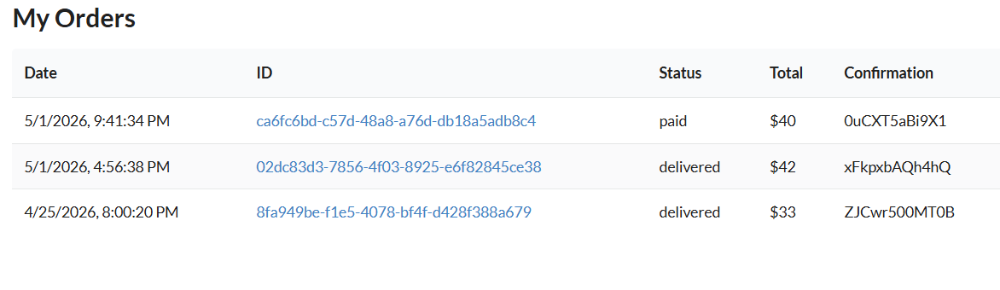

## 2. Why This Works / Root Cause

The vulnerability is a function-level authorization failure. `DVSA-ADMIN-UPDATE-ORDERS` receives an order ID and an item object, then applies administrative updates without first proving that the caller is an administrator.

Authentication only proves who the user is. Authorization must also prove what the user is allowed to do. In this lesson, a normal authenticated user could reach admin-only order update behavior and change an order status through the public `/order` path.

Exploit path:

```text
Normal user token
-> POST /dvsa/order
-> injected payload executes in DVSA-ORDER-MANAGER
-> DVSA-ORDER-MANAGER invokes DVSA-ADMIN-UPDATE-ORDERS
-> admin order update is attempted
```

## 3. Environment and Setup

The API URL was collected from API Gateway by opening the deployed `dvsa` stage and copying the Invoke URL.

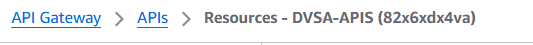

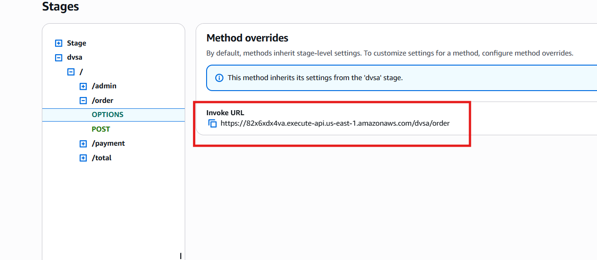

The Cognito access token was captured from browser DevTools under:

```text
Application -> Local Storage -> DVSA website URL
```

The token value is not stored in this repository.

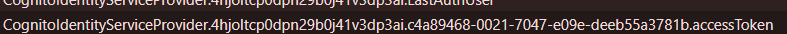

## 4. Reproduction Steps

The exploit was executed from Windows PowerShell. The real access token is replaced with `<ACCESS_TOKEN_REDACTED>`.

```powershell
$API = "https://82x6xdx4va.execute-api.us-east-1.amazonaws.com/dvsa/order"
$TOKEN = "<ACCESS_TOKEN_REDACTED>"
$USER_ID = "c4a89468-0021-7047-e09e-deeb55a3781b"
$ORDER_ID = "ca6fc6bd-c57d-48a8-a76d-db18a5adb8c4"
$CONFIRMATION_TOKEN = "0uCXT5aBi9X1"
$NEW_STATUS = 120
```

The payload creates an event for `DVSA-ADMIN-UPDATE-ORDERS` and sends it through the public `/order` endpoint using the `node-serialize` function marker.

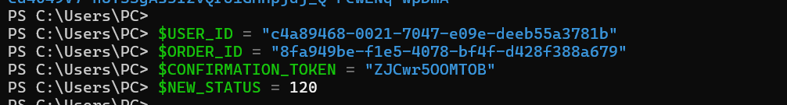

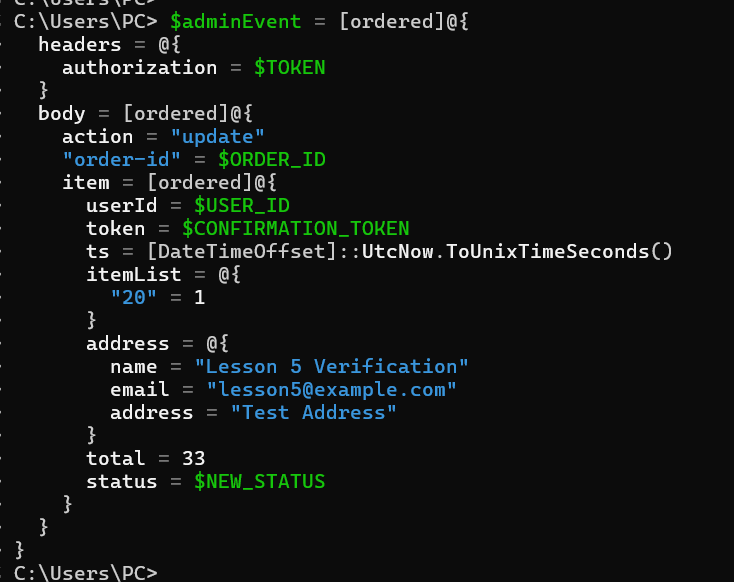

## 5. Evidence and Proof

Before the exploit, the order appeared in the normal Orders page. After the payload was sent, the order status could be changed through the administrative update path even though the request came from a normal user flow.

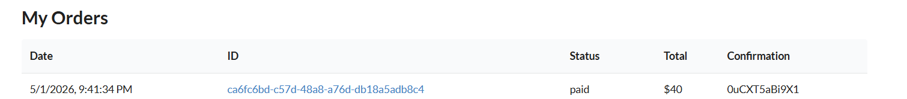

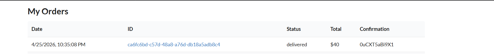

This proves the access-control issue: a normal user request was able to reach admin-only order update behavior.

## 6. Fix Strategy / Probable Mitigation

The Lesson 5 fix is applied inside:

```text
DVSA-ADMIN-UPDATE-ORDERS / admin_update_orders.py
```

The admin update function must not trust that only administrators can reach it. Before processing `add`, `update`, or `delete`, it must check that the decoded token belongs to an admin user.

This fix is intentionally scoped to Lesson 5:

```text
Lesson 1 covers event injection.
Lesson 7 covers over-privileged IAM roles.
Lesson 9 covers vulnerable dependencies.
Lesson 5 focuses on admin authorization.
```

## 7. Code / Config Changes

The check was inserted inside `lambda_handler` immediately after the token is decoded and the username is extracted:

```python
token = json.loads(auth_data)
user = token["username"]

if token.get("custom:is_admin") != "true":
    return {
        "status": "err",
        "msg": "Unauthorized",
        "statusCode": 403
    }
```

This placement is important because normal users are rejected before the function reads:

```python
action = event["body"]["action"]
orderId = event["body"]["order-id"]
item = event["body"]["item"]
```

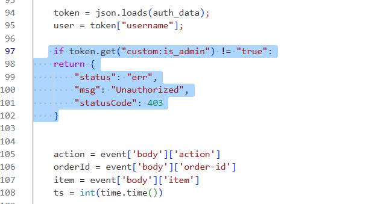

The fixed file is included here:

```text
admin_update_orders_fixed.py
```

## 8. Verification After Fix

After deploying the fix, the same Lesson 5 payload was repeated with a normal user access token.

Verification target:

```text
Order ID: 8fa949be-f1e5-4078-bf4f-d428f388a679
Initial status: delivered
Total: $33
Confirmation token: ZJCwr500MT0B
```

Before the verification attempt, the order was still visible as `delivered`.


The exploit was then sent again. The API returned:

```json
{"status":"err","msg":"unknown action"}
```

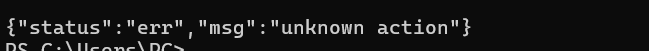

After the verification attempt, the order still showed the same status. No order status was changed by the attack.

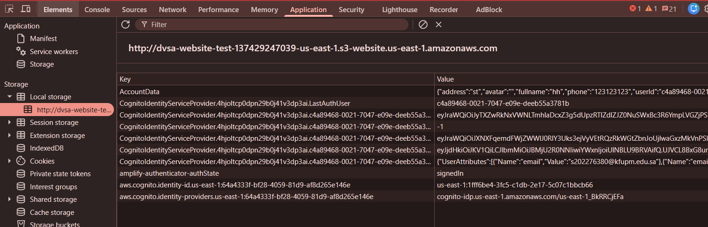

This confirms that the exploit path no longer updates the order.

## 9. Structured Operation and Security Analysis

| Field | Summary |
|---|---|
| Vulnerability | Broken Access Control |
| Intended rule | Only verified admin users may perform administrative order updates. |
| Exploit behavior | A normal user request reached admin update behavior through the public `/order` path. |
| Fix location | `DVSA-ADMIN-UPDATE-ORDERS / admin_update_orders.py` |
| Fix | Add `custom:is_admin` authorization check before reading or applying the admin action. |
| Verification | Re-running the payload did not change the order status. |

## 10. Takeaway / Lessons Learned

Administrative functions must enforce authorization even if they are not directly exposed in the user interface. A hidden Lambda function is still part of the attack surface if another backend function can reach it.

The key lesson is that authentication is not enough. A real user token proves identity, but the backend must still verify whether that user is allowed to perform the requested administrative action.

## Files

| File | Purpose |
|---|---|
| `README.md` | Lesson 5 explanation with screenshots. |
| `admin_update_orders_fixed.py` | Fixed Lambda function code. |
| `lesson5_exploit.ps1` | PowerShell exploit/verification script with a token placeholder. |
