# Lesson 7: Over-Privileged Function

## 1. Goal and Vulnerability Summary

This lesson demonstrates that a Lambda execution role can grant far more AWS permissions than a function needs. In serverless systems, this significantly increases the blast radius if the function is compromised.

---

## 2. Why This Works / Root Cause

The vulnerability is caused by excessive IAM permissions attached to the Lambda execution role. Any code running inside the function inherits these permissions. If exploited, an attacker can perform any allowed AWS action, even unrelated to the function’s purpose.

---

## 3. Environment and Setup

### Step 1: Find the function
1. Open AWS Console
2. Go to Lambda → Functions
3. Search for `DVSA-SEND-RECEIPT-EMAIL`

### Step 2: Open the execution role
1. Open the function
2. Go to Configuration → Permissions
3. Click the execution role

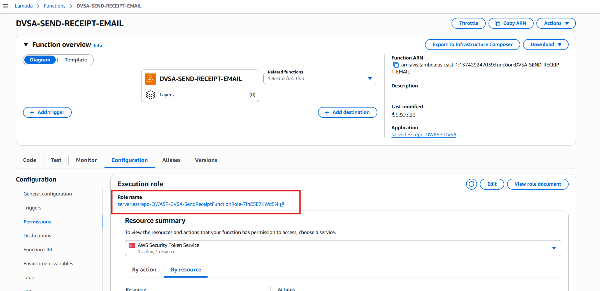

---

## 4. Reproduction Steps

The IAM role policies were reviewed.

### Observations:
- `AmazonSESFullAccess` grants full SES access
- S3 policy allows:
    - `arn:aws:s3:::*`
    - `arn:aws:s3:::*/*`
- DynamoDB policy allows:
    - `arn:aws:dynamodb:us-east-1:137429247039:table/*`

These indicate over-privileged access.

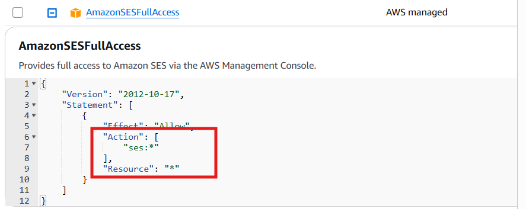
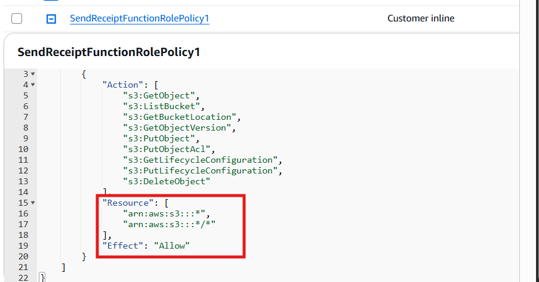
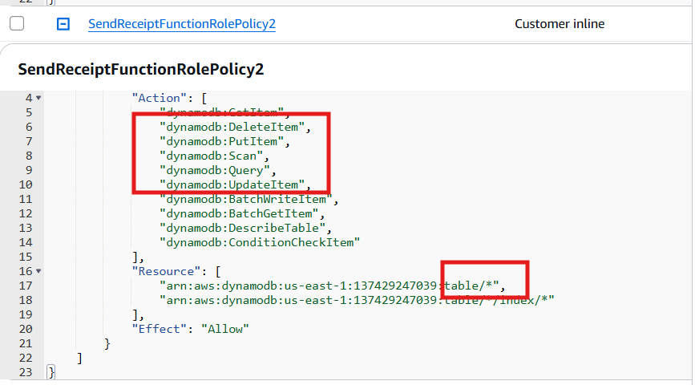

---

## 5. Evidence and Proof

### Step 1: Open Policy Simulator
AWS → IAM → Policy Simulator

### Step 2: Select role
Select:
`serverlessrepo-OWASP-DVSA-SendReceiptFunctionRole-...`

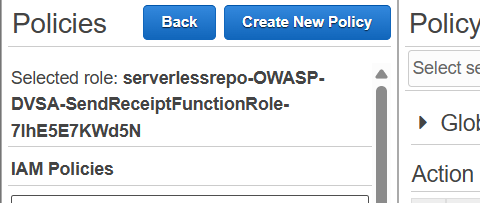

---

### Step 3: Test S3 access

Test:
- `s3:GetObject`
- `s3:PutObject`

Result:
- Allowed

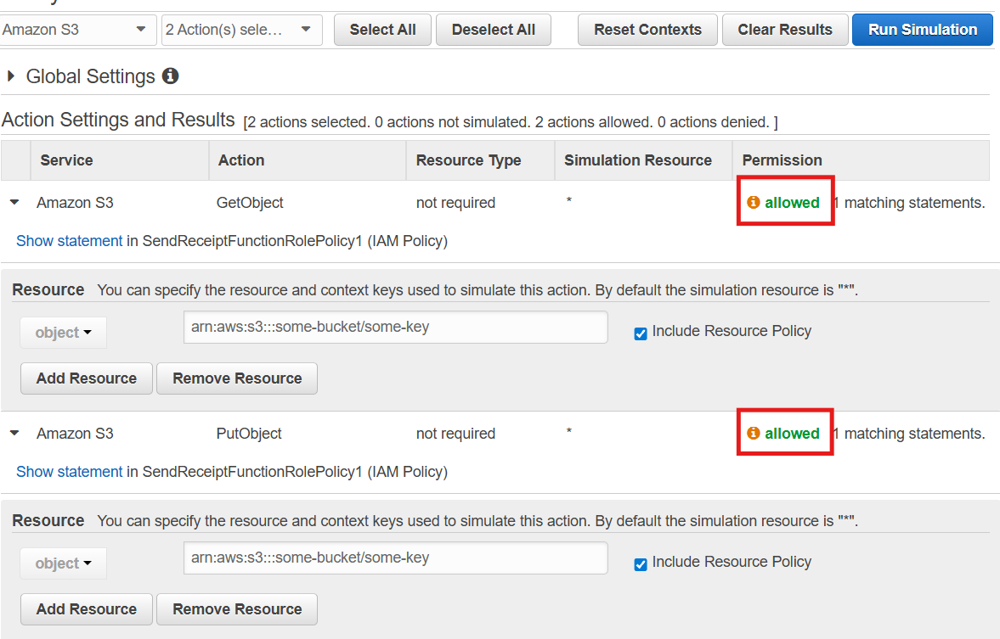

---

### Step 4: Test DynamoDB access

Test:
- `Scan`
- `GetItem`
- `PutItem`
- `DeleteItem`

Result:
- Allowed

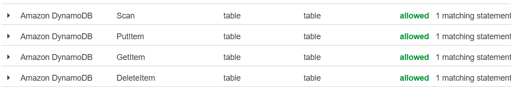

---

## 6. Fix Strategy / Probable Mitigation

Apply the **principle of least privilege**:

- Restrict S3 to receipts bucket
- Restrict DynamoDB to orders table
- Replace full SES access with minimal permissions

---

## 7. Code / Config Changes

Changes made:

- Removed `AmazonSESFullAccess`
- Added minimal SES policy (`SendEmail`)
- Restricted S3 to:
  `dvsa-receipts-bucket-137429247039-us-east-1`
- Restricted DynamoDB to:
  `DVSA-ORDERS-DB`

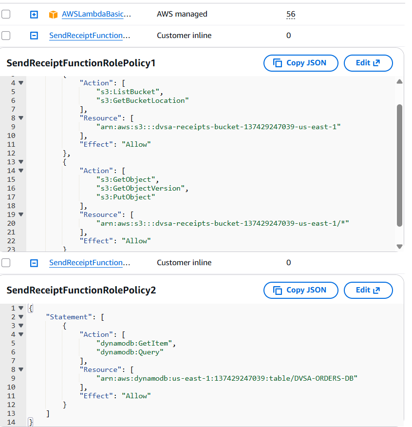
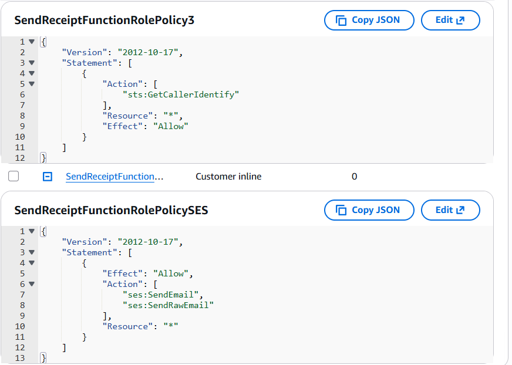
---

## 8. Verification After Fix

Policy Simulator tests were repeated.

### Results:
- S3 access → Denied
- DynamoDB access → Denied

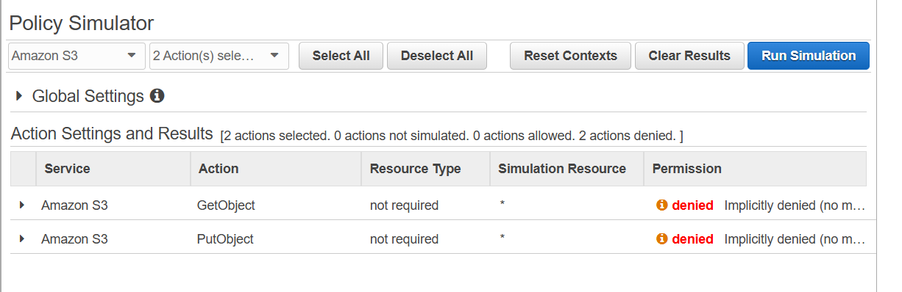
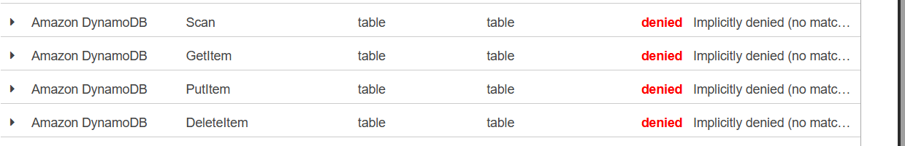
---

### Application Test

- Order placed successfully
- Receipt function executed correctly

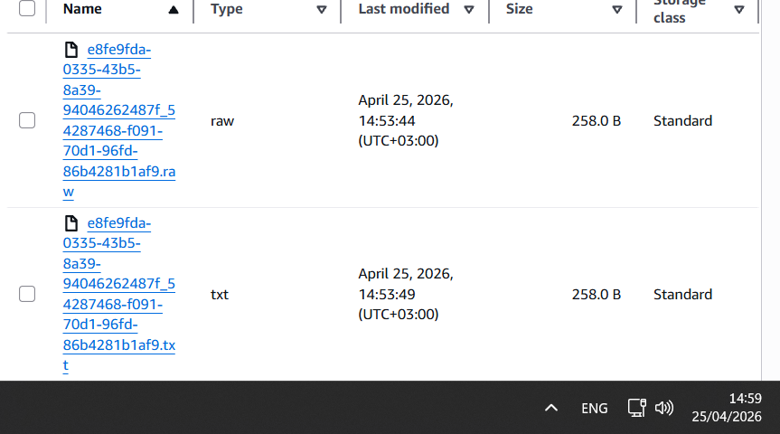

---

## 9. Structured Operation and Security Analysis

### Table A

| Vulnerability | Intended Rule(s) | Artifacts Used | Normal Behavior | Exploit Behavior |
|--------------|-----------------|---------------|-----------------|------------------|
| Over-Privileged Function | Function should only have minimum permissions | IAM policies, Simulator | App works normally | Access allowed to unrelated resources |

---

### Table B

| Vulnerability | Deviation | Class | Fix | Verification |
|--------------|----------|------|-----|-------------|
| Over-Privileged Function | Excess permissions | Misconfiguration | IAM restricted | Access denied after fix |

---

## 10. Takeaway / Lessons Learned

In serverless architectures, the Lambda execution role acts as the system’s identity. If compromised, attackers inherit all its permissions.

Over-privileged roles greatly increase risk:
- Full S3 access
- Full DynamoDB access
- Full SES access

Applying least privilege reduces this risk:
- Limit S3 to required bucket
- Limit DynamoDB to required table
- Allow only necessary SES actions

This significantly reduces the attack surface while maintaining functionality.

---