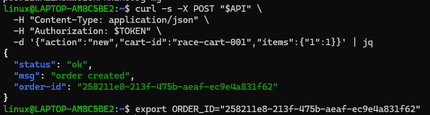
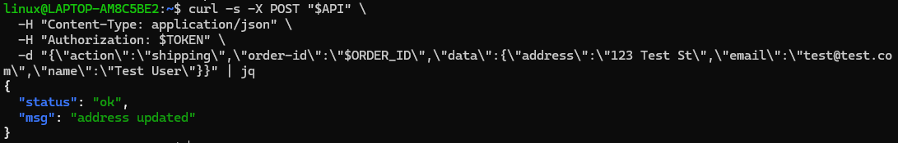
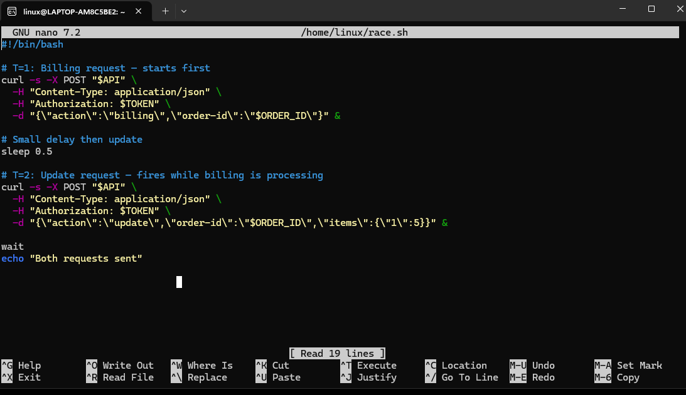
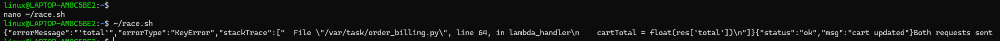
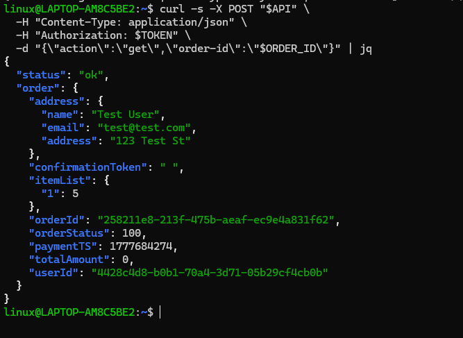
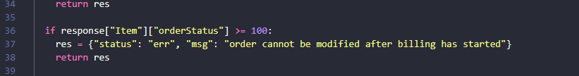
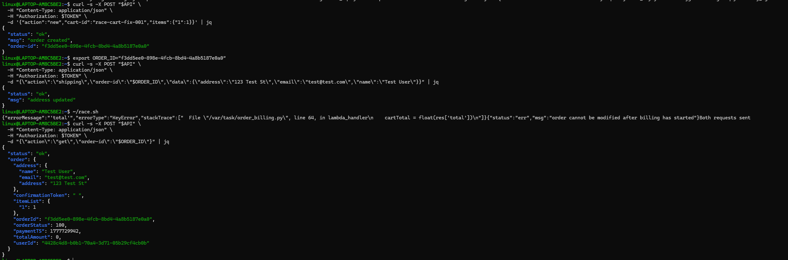

# Lesson #8: Logic Vulnerabilities — Race Condition

---

## Part 1) Goal and Vulnerability Summary

This lesson demonstrates a Logic Vulnerability in the form of a race condition within the DVSA order-processing workflow. The affected components are the DVSA-ORDER-MANAGER Lambda function and the DVSA-ORDER-UPDATE Lambda function backed by the DVSA-ORDERS-DB DynamoDB table. The application allows users to create an order, add shipping details, and then proceed to billing. However, the backend did not lock the order state when billing began, meaning an update request could be processed concurrently with a billing request. By sending both requests simultaneously using a shell script, an attacker was able to update the order quantity to 5 items while billing processed only 1 item, resulting in the final order showing 5 items with a totalAmount of 0 — meaning the attacker received more items than they paid for.

---

## Part 2) Why This Works / Root Cause

The vulnerability existed because the order update handler in DVSA-ORDER-UPDATE checked `orderStatus > 110` before blocking updates. Since the order status is set to 100 when billing starts, the condition `100 > 110` evaluated to false, meaning updates were still allowed while billing was in progress. When both requests fired simultaneously, the update slipped through before billing could complete and lock the order. The root cause is therefore a flawed status threshold check that failed to account for the billing-in-progress state, combined with no concurrency control or locking mechanism to prevent concurrent modifications.

---

## Part 3) Environment and Setup

- **API Endpoint:** `https://[API-ID].execute-api.us-east-1.amazonaws.com/Stage/order`
- **Affected Lambda Functions:** `DVSA-ORDER-MANAGER`, `DVSA-ORDER-UPDATE`
- **Affected File:** `update_order.py` in `DVSA-ORDER-UPDATE`
- **AWS Region:** us-east-1
- **Tools:** curl, bash, jq, Browser DevTools, AWS Lambda Console, CloudWatch Logs

---

## Part 4) Reproduction Steps

**Step 1 — Export API URL and TOKEN from DevTools**

Logged into DVSA in the browser, opened DevTools (F12) → Network → Fetch/XHR, clicked an order request, and copied the Request URL and Authorization header.

```bash
export API="https://[API-ID].execute-api.us-east-1.amazonaws.com/Stage/order"
export TOKEN="[REDACTED]"
```

**Step 2 — Create a new order with 1 item**

```bash
curl -s -X POST "$API" \
  -H "Content-Type: application/json" \
  -H "Authorization: $TOKEN" \
  -d '{"action":"new","cart-id":"race-cart-001","items":{"1":1}}' | jq
```

Saved the returned order-id:

```bash
export ORDER_ID="[returned order-id]"
```

**Step 3 — Add shipping details**

```bash
curl -s -X POST "$API" \
  -H "Content-Type: application/json" \
  -H "Authorization: $TOKEN" \
  -d "{\"action\":\"shipping\",\"order-id\":\"$ORDER_ID\",\"data\":{\"address\":\"123 Test St\",\"email\":\"test@test.com\",\"name\":\"Test User\"}}" | jq
```

**Step 4 — Create and run race.sh**

Created `race.sh` firing both billing and update simultaneously:

```bash
chmod +x ~/race.sh
~/race.sh
```

**Step 5 — Confirm the order state**

```bash
curl -s -X POST "$API" \
  -H "Content-Type: application/json" \
  -H "Authorization: $TOKEN" \
  -d "{\"action\":\"get\",\"order-id\":\"$ORDER_ID\"}" | jq
```

---

## Part 5) Evidence and Proof

**Screenshot 1 — Export API and TOKEN:**


**Screenshot 2 — Create new order and export ORDER_ID:**


**Screenshot 3 — Add shipping address:**


**Screenshot 4 — Contents of race.sh:**


**Screenshot 5 — Run race.sh output showing update succeeded:**


**Screenshot 6 — Order state showing itemList:5 and totalAmount:0:**


---

## Part 6) Fix Strategy / Probable Mitigation

The fix was applied inside the DVSA-ORDER-UPDATE Lambda function in `update_order.py`. The original code checked if the order status was greater than 110 before blocking updates, which meant that an order with status 100 (billing started) could still be modified. The fix changes this threshold so that any order with a status of 100 or above is immediately rejected. This directly addresses the root cause because once billing begins the order status is set to 100, and any concurrent update request will now be caught and blocked before the item list can be changed.

---

## Part 7) Code / Config Changes

**File:** `update_order.py` in `DVSA-ORDER-UPDATE` Lambda

**BEFORE (Vulnerable):**
```python
if response["Item"]["orderStatus"] > 110:
    res = {"status": "err", "msg": "order already paid"}
    return res
```

**AFTER (Fixed):**
```python
if response["Item"]["orderStatus"] >= 100:
    res = {"status": "err", "msg": "order cannot be modified after billing has started"}
    return res
```

---

## Part 8) Verification After Fix

**Screenshot 7 — Fix applied in Lambda console:**


**Screenshot 8 — race.sh output after fix showing update blocked:**


The update request now returns:
```json
{"status": "err", "msg": "order cannot be modified after billing has started"}
```

Legitimate updates performed before billing still succeed normally, confirming the fix did not break the intended workflow.

---

## Part 9) Structured Operation and Security Analysis

### Table A

| Vulnerability | Intended Rule(s) | Artifacts Used | Normal Behavior Evidence | Exploit Behavior Evidence |
|---|---|---|---|---|
| Logic Vulnerabilities — Race Condition (Lesson #8) | Once billing has started, the order must not be modifiable. The billed amount must always reflect the actual items at the time of payment. | DVSA browser order workflow, curl API requests and responses, order state via get action, race.sh terminal output, update_order.py source code, DynamoDB order record | A normal order with 1 item is billed correctly with totalAmount reflecting the correct price and itemList showing quantity 1 | After running race.sh, the order shows itemList:{"1":5} with totalAmount:0, meaning the update succeeded after billing started and the attacker received 5 items while paying nothing |

### Table B

| Vulnerability | Why This Is a Deviation | Deviation Class | Fix Applied (Where) | Post-Fix Verification | Optional Latency |
|---|---|---|---|---|---|
| Logic Vulnerabilities — Race Condition (Lesson #8) | The backend allowed the order quantity to be updated after billing had already been initiated. The flawed status threshold (> 110 instead of >= 100) left a window where concurrent updates could change the order contents without paying the correct amount. | Intentional misuse / security-relevant abuse | Status threshold changed from > 110 to >= 100 in update_order.py inside DVSA-ORDER-UPDATE Lambda | Update request after billing now returns error. Order quantity remains at 1. Legitimate pre-billing updates still work. (Screenshot 8) | Not measured |

---

## Part 10) Takeaway / Lessons Learned

This lesson taught us that not all vulnerabilities come from bad code or missing security checks — sometimes the problem is in the logic itself. The application assumed that users would always follow the intended steps in order: create the order, add shipping, then pay. It never considered that someone could send two requests at the same time to break that flow. What made this especially interesting in a serverless environment is that Lambda functions run independently, so there is no built-in way to stop two requests from being processed at the same time. The main lesson we took from this is that the server should never trust that the client will follow the correct flow. Every state-changing operation needs to check the current state of the resource first before doing anything.